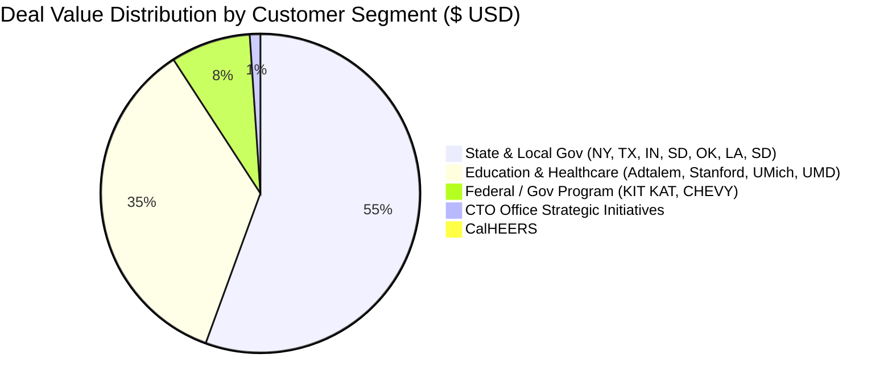

# Executive Productivity & Activity Report
**Owner:** Peter Fisher  
**Practice / Specialty:** AI/ML  
**Reporting Period:** January 2026 – June 2026 (Weekly & Quarterly Breakdown)  
**Total Assigned Practice ERs:** 75 (Peter Fisher: 32 total | Sample Set Analyzed: 21)

---

## 📊 Executive Summary & Key Performance Indicators (KPIs)

| Metric | Value | Notes / Breakdown |
|---|---|---|
| **Total Analyzed Engagements** | **21 Requests** | Part of 32 total ERs assigned to Peter Fisher |
| **Total Pipeline / Deal Value** | **$85,091,680.79 USD** | Across state, local, education, federal, & enterprise |
| **Average Engagement Value** | **$4,051,984.80 USD** | Driven by major state & enterprise AI transformation deals |
| **Top Client by Deal Volume** | **NYS Office of IT Services** | $44,063,646.00 (ER-478208) |
| **Top Client by Request Frequency** | **KIT KAT-GOV** | 3 requests ($4,792,076.00 total) |
| **Primary Requesters / Sponsors** | **Amanda Stange (4)**, **Charlene Gorman (3)**, **Allyson Spring (3)**, **Jaime Wagner (2)** | High recurring collaboration across CTO office & state agencies |

> [!IMPORTANT]
> **Key Impact Highlight:** Over **$85M** in AI/ML opportunity value managed in H1 2026 across 21 high-impact engagements spanning state governments (NY, TX, IN, SD, OK), higher education (Stanford, Univ of Michigan, UMD, Adtalem), municipal entities (LA, San Diego), and Office of the CTO strategic initiatives.

---

## 📅 Monthly & Weekly Activity Breakdown (H1 2026)

### **June 2026 (Week 24 & Week 23)**
* **Week of June 15, 2026:**
  * **ER-490466** | *Office of The Chief Technology Officer* | **$450,000.00** | Sponsor: Jaime Wagner
* **Week of June 1, 2026:**
  * **ER-486883** | *Texas Department of Transportation* | **$150,000.00** | Sponsor: Charlene Gorman
  * **ER-486289** | *Office of The Chief Technology Officer* | **$450,000.00** | Sponsor: Jaime Wagner

---

### **May 2026 (Week 21, Week 20, Week 19)**
* **Week of May 18, 2026:**
  * **ER-482814** | *State of Indiana* | **$1,080,000.00** | Sponsor: Brent Evans
  * **ER-482724** | *City of San Diego* | **$10,000.00** | Sponsor: Amanda Stange
  * **ER-481928** | *Adtalem Global Education Inc.* | **$25,831,021.00** | Sponsor: Joel Pingel
  * **ER-481813** | *Stanford University (Leland Stanford Jr. Univ)* | **$772,480.00** | Sponsor: Amanda Stange
* **Week of May 10, 2026:**
  * **ER-479444** | *City of Los Angeles* | **$500,000.00** | Sponsor: Amanda Stange
* **Week of May 3, 2026:**
  * **ER-478904** | *CHEVY-GOV* | **$2,000,000.00** | Sponsor: Nicole House
  * **ER-478208** | *New York State Office of IT Services* | **$44,063,646.00** | Sponsor: Mike Baraiolo

---

### **April 2026 (Week 18, Week 17, Week 16)**
* **Week of April 26, 2026:**
  * **ER-476345** | *New York State Dept of Financial Services* | **$50,000.00** | Sponsor: Mike Baraiolo
  * **ER-476290** | *CalHEERS* | **$675,828.17** | Sponsor: Amanda Stange
  * **ER-475879** | *Univ. of Michigan Health IT* | **$3,000,000.00** | Sponsor: Brent Evans
* **Week of April 12, 2026:**
  * **ER-472480** | *Workforce Commission, Texas* | **$140,628.00** | Sponsor: Charlene Gorman
  * **ER-472476** | *KIT KAT-GOV* | **$3,992,076.00** | Sponsor: Allyson Spring

---

### **March 2026 (Week 13)**
* **Week of March 22, 2026:**
  * **ER-465456** | *State of South Dakota* | **$325,000.00** | Sponsor: Joel Pingel

---

### **February 2026 (Week 9, Week 8)**
* **Week of February 22, 2026:**
  * **ER-457026** | *Texas Department of Transportation* | **$150,000.00** | Sponsor: Charlene Gorman
  * **ER-456899** | *Oklahoma Health Care Authority* | **$81,001.62** | Sponsor: Jeremy Dautenhahn
* **Week of February 15, 2026:**
  * **ER-456046** | *University of Maryland* | **$0.00** (Advisory / Initial Discovery) | Sponsor: Katie Driscoll

---

### **January 2026 (Week 5)**
* **Week of January 25, 2026:**
  * **ER-450883** | *KIT KAT-GOV* | **$400,000.00** | Sponsor: Allyson Spring
  * **ER-450733** | *KIT KAT-GOV* | **$400,000.00** | Sponsor: Allyson Spring

---

## 📈 Client Sector & Sponsor Portfolio Distribution



### Top Requesters / Collaborators
1. **Amanda Stange** (4 ERs | $2,058,308.17 total) – City of SD, Stanford, City of LA, CalHEERS
2. **Mike Baraiolo** (2 ERs | $44,113,646.00 total) – NYS ITS & NYS Dept of Financial Services
3. **Joel Pingel** (2 ERs | $26,156,021.00 total) – Adtalem & State of South Dakota
4. **Allyson Spring** (3 ERs | $4,792,076.00 total) – KIT KAT-GOV account team
5. **Charlene Gorman** (3 ERs | $440,628.00 total) – TX Dept of Transportation & TX Workforce Commission
6. **Jaime Wagner** (2 ERs | $900,000.00 total) – Office of the CTO AI initiatives

---

## 🛠️ Step-by-Step Guide: How to Create Weekly Activity Reports

To standardize your weekly reporting process moving forward, follow this simple 4-step framework:

### 1. Data Capture Template
Maintain a simple spreadsheet or markdown log capturing these core fields for every Expert Request:
- **Date Received / Closed**: `MM/DD/YYYY`
- **ER Identifier**: e.g. `ER-123456`
- **Client / Organization**: e.g. `State of Indiana`
- **Value (USD)**: Total contract or request value
- **Sponsor / Primary Contact**: Requester name
- **Status / Activity Summary**: Deliverables produced, AI/ML models evaluated, architecture reviews conducted, etc.

### 2. Standard Weekly Report Structure
Format each weekly update using this clean template:

```markdown
# Weekly Activity Report – Week [XX] ([Start Date] – [End Date])
**Name:** Peter Fisher | **Domain:** AI/ML

### 🚀 Highlights & Key Accomplishments
- Completed AI architecture review for [Client Name] (ER-[Number], $XXX,XXX).
- Led technical discovery session with [Sponsor Name] on [Topic].

### 📋 Engagement Breakdown
| ER # | Client | Value (USD) | Sponsor | Key Deliverable / Status |
|---|---|---|---|---|
| ER-XXXXXX | [Client] | $XX,XXX | [Sponsor] | [Completed / In Progress] |

### 🎯 Next Week Priorities
- Deliver final AI deployment roadmap for [Client].
- Follow up on pending ER requirements with [Sponsor].
```

---

## 📑 Complete Master Data Ledger (Sorted by Date Descending)

| Date | ER ID | Organization / Client | Value (USD) | Primary Contact |
|---|---|---|---|---|
| **06/16/2026** | ER-490466 | Office of The Chief Technology Officer | $450,000.00 | Jaime Wagner |
| **06/04/2026** | ER-486883 | Texas Department of Transportation | $150,000.00 | Charlene Gorman |
| **06/03/2026** | ER-486289 | Office of The Chief Technology Officer | $450,000.00 | Jaime Wagner |
| **05/21/2026** | ER-482814 | State of Indiana | $1,080,000.00 | Brent Evans |
| **05/21/2026** | ER-482724 | City of San Diego | $10,000.00 | Amanda Stange |
| **05/19/2026** | ER-481928 | Adtalem Global Education Inc. | $25,831,021.00 | Joel Pingel |
| **05/19/2026** | ER-481813 | The Board of Trustees of The Leland Stanford Junior University | $772,480.00 | Amanda Stange |
| **05/11/2026** | ER-479444 | City of Los Angeles | $500,000.00 | Amanda Stange |
| **05/08/2026** | ER-478904 | CHEVY-GOV | $2,000,000.00 | Nicole House |
| **05/06/2026** | ER-478208 | New York State Office of Information Technology Services | $44,063,646.00 | Mike Baraiolo |
| **04/29/2026** | ER-476345 | New York State Department of Financial Services | $50,000.00 | Mike Baraiolo |
| **04/29/2026** | ER-476290 | CalHEERS | $675,828.17 | Amanda Stange |
| **04/28/2026** | ER-475879 | University of Michigan Health Information Technology | $3,000,000.00 | Brent Evans |
| **04/16/2026** | ER-472480 | Workforce Commission, Texas | $140,628.00 | Charlene Gorman |
| **04/16/2026** | ER-472476 | KIT KAT-GOV | $3,992,076.00 | Allyson Spring |
| **03/25/2026** | ER-465456 | State of South Dakota | $325,000.00 | Joel Pingel |
| **02/24/2026** | ER-457026 | Texas Department of Transportation | $150,000.00 | Charlene Gorman |
| **02/23/2026** | ER-456899 | Oklahoma Health Care Authority | $81,001.62 | Jeremy Dautenhahn |
| **02/19/2026** | ER-456046 | University of Maryland | $0.00 | Katie Driscoll |
| **01/28/2026** | ER-450883 | KIT KAT-GOV | $400,000.00 | Allyson Spring |
| **01/27/2026** | ER-450733 | KIT KAT-GOV | $400,000.00 | Allyson Spring |
