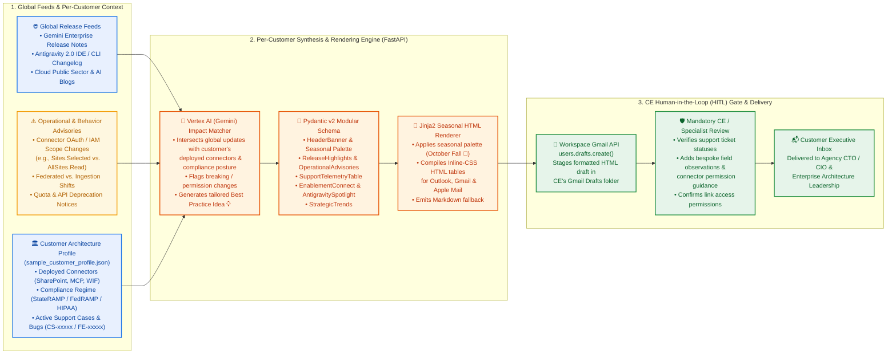
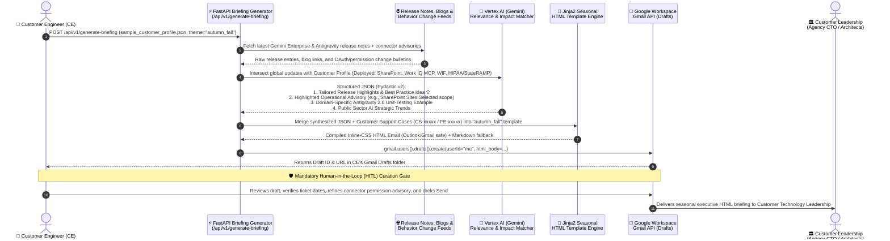

# Reference Architecture: Gemini Weekly & Monthly Customer Updates

> **Disclaimer**: This repository and its contents are provided for illustration and educational purposes only as example code. This is not an official Google product or officially supported Google Cloud project. This code is provided as-is for demonstration purposes and is NOT intended or supported for production workloads.

---

## 1. Architectural Overview: How It Works for a Particular Customer

Enterprise and Public Sector customers adopting **Google Cloud Gemini Enterprise** and **Google Antigravity** experience rapid platform evolution—spanning new foundation models, Bring-Your-Own (BYO) Model Context Protocol (MCP) connectors, security guardrails (Model Armor), and subtle connector permission or behavior changes.

To establish a standardized, executive-grade communication cadence without overwhelming Customer Engineers (CEs) and Field Sales Representatives (FSRs), the **Gemini Weekly Updates** architecture pairs **automated release & telemetry aggregation** with **customer-aware AI filtering** and a **mandatory Human-in-the-Loop (HITL) CE curation gate**:

---

## 2. End-to-End Sequence Diagram: Generating a Briefing for a Single Customer

---

## 3. Why Hybrid Automation + CE HITL Curation Matters

A core architectural lesson from real-world enterprise deployments is that **100% unattended newsletter automation is insufficient for complex enterprise cloud accounts**:

1. **Catching Subtle Operational & Permission Changes**:
   - Standard public release notes emphasize major feature launches (GA announcements), but customers are frequently impacted by nuanced connector behavior shifts or permission requirements—such as transitioning a SharePoint integration from broad `AllSites.Read` permissions to least-privilege `Sites.Selected` scopes, or understanding licensing dependencies between native data ingestion connectors and third-party MCP servers.
   - By feeding a **Customer Architecture Profile** (`deployed_connectors`, `identity_provider`, `compliance_frameworks`) into the synthesis prompt *and* staging the output as a **Gmail Draft**, the CE can inject immediate, high-value architectural guidance before sending.
2. **Accurate Support & Engineering Escalation Telemetry**:
   - Generic marketing newsletters never reflect an account's live support tickets, feature requests (`FE-xxxxx`), or active Proof-of-Concept (POC) blockers (`CS-xxxxx`).
   - Section 2 of the briefing embeds a structured **Account Health & Support Telemetry** table directly inside the executive update, giving customer leadership a single source of truth across platform releases and active support cases.
3. **Cross-Client Email Rendering (Gmail, Microsoft Outlook & Apple Mail)**:
   - Public sector agencies and large enterprises predominantly read email in **Microsoft Outlook (Desktop & Web)**, which strips external `<style>` sheets and renders raw Markdown pipe tables (`| Col 1 | Col 2 |`) without borders or cell padding.
   - The Jinja2 rendering layer compiles **explicit inline CSS** on every `<table>`, `<th>`, `<td>`, and callout banner, guaranteeing crisp typography and seasonal theming across Outlook, Gmail, and Apple Mail.

---

## 4. Modular Pydantic v2 Data Contract

Every section of the briefing is modeled as an isolated JSON-serializable schema so the FastAPI backend can populate templates deterministically:

| Module Name | Schema Responsibility | Primary Data Source |
| :--- | :--- | :--- |
| **`CustomerProfile`** | Agency/Organization name, recipient group, compliance frameworks (`StateRAMP`, `FedRAMP High`, `HIPAA`), deployed connectors, and Google Account Team roster. | Per-customer JSON profile / CRM |
| **`ThemeSelection`** | Visual color tokens (`primary_accent`, `secondary_accent`, `border_gold`, `bg_cream`) and seasonal emoji/banner metadata (`autumn_fall`, `winter_frost`, `spring_blossom`, `google_core`). | Request parameter |
| **`ReleaseHighlights`** | Top 2–3 GA/Preview platform launches mapped to the customer's compliance and architecture footprint, plus 1 actionable **Best Practice Idea 💡**. | Release Notes + Vertex AI Gemini |
| **`OperationalAdvisories`** |Proactive callout box highlighting connector permission changes, OAuth scope best practices (e.g., `Sites.Selected`), or deprecation timelines relevant to the customer. | Connector Advisories + CE Input |
| **`SupportTelemetry`** | Array of active support tickets, bug IDs, and feature escalations (`case_id`, `workload`, `description`, `status`, `target_date`, `google_lead`). | Support Case Tracker / CE Input |
| **`EnablementConnect`** | Upcoming virtual workshops, hands-on labs, and 1-click Google Calendar appointment schedule links for bi-weekly architecture office hours. | Account Team Calendar Config |
| **`AntigravitySpotlight`** | Pro-code developer agent highlights (Google Antigravity 2.0 IDE/CLI) paired with a domain-specific software engineering example. | Antigravity Changelog + Gemini |
| **`StrategicTrends`** | Forward-looking executive analysis covering Long-Running Autonomous Agents, Agent Gateway Zero-Trust governance, and Public Sector AI compliance. | Curated Field CTO / Specialist Briefs |
