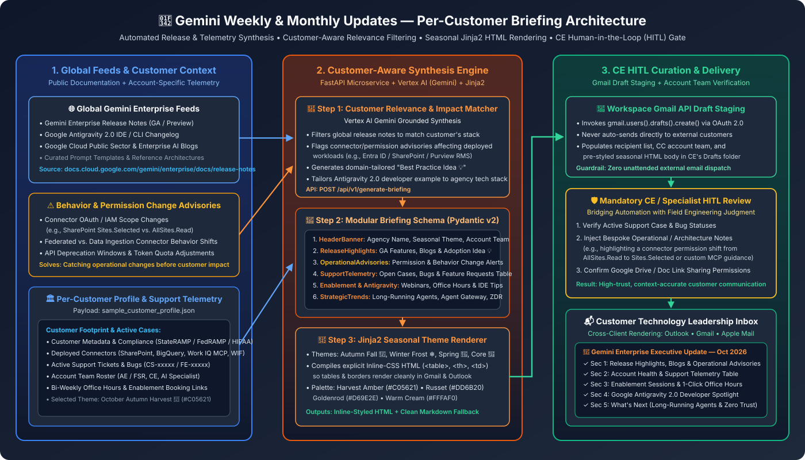
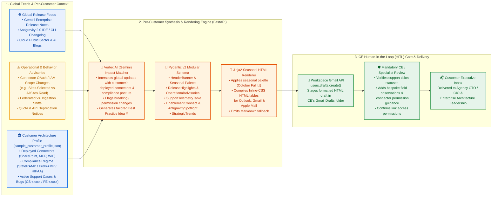

# 🍂 Gemini Weekly & Monthly Customer Updates (`Gemini_Weekly_Updates`)

> **Disclaimer**: This repository and its contents are provided for illustration and educational purposes only as example code. This is not an official Google product or officially supported Google Cloud project. This code is provided as-is for demonstration purposes and is NOT intended or supported for production workloads. The views, code, and opinions expressed in this repository are those of the author(s) and do not necessarily reflect the position, opinions, or official policy of Google LLC or Google Cloud Platform.



---

## 1. Executive Summary & Concept Overview

Establishing a standardized, high-touch communication cadence between Google Cloud field teams—**Customer Engineers (CEs)**, **Field Sales Representatives (FSRs)**, and **AI Specialists**—and strategic enterprise or public sector accounts is essential for accelerating **Gemini Enterprise** adoption, managing operational change, and providing transparent support health telemetry.

Inspired by enterprise behavior-change and release notification standards, **Gemini Weekly Updates** provides a reusable briefing architecture, seasonal HTML/Markdown email templates (showcased with an **October Autumn Harvest 🍂** aesthetic), and a reference **FastAPI + Vertex AI (Gemini)** pipeline that generates customer-specific executive updates.

### Why Hybrid Automation + CE Human-in-the-Loop (HITL) Curation?

While automated scraping of release notes and support tickets can assemble 80%+ of a weekly or monthly newsletter, **purely unattended automation can miss critical operational or permission nuances** that impact a specific customer's environment—such as a connector permission shift from broad `AllSites.Read` consent to least-privilege `Sites.Selected` scopes in SharePoint Online.

This architecture solves that challenge through a **three-part design**:
1. **Per-Customer Footprint Matching (`sample_customer_profile.json`)**: Global release notes, blogs, and behavior-change advisories are filtered against the specific connectors (`SharePoint`, `Work IQ MCP`, `BigQuery`, `WIF`), compliance frameworks (`StateRAMP`, `FedRAMP High`, `HIPAA`), and developer tools (`Google Antigravity 2.0`) deployed in the customer's tenant.
2. **Proactive Operational & Connector Advisory Banner**: Dedicated top-of-email callout block for permission changes, OAuth scope recommendations, and deprecation windows.
3. **Mandatory CE HITL Review Gate via Gmail Drafts**: Instead of auto-dispatching emails to external customers, the pipeline stages a pre-styled **Inline-CSS HTML Draft** in the CE's Gmail Drafts folder (`users.drafts.create`), allowing the account team to verify support case statuses and inject bespoke architectural guidance before sending.

---

## 2. How It Works for a Particular Customer (Architecture)

See [`ARCHITECTURE.md`](./ARCHITECTURE.md) for the complete architectural deep dive, end-to-end sequence diagram, and Pydantic v2 data contracts.



---

## 3. Architectural Design & Seasonal Theming Specifications

The **October Fall Customer Briefing Template** combines a warm seasonal aesthetic with an executive-level corporate layout engineered for cross-client email compatibility:

- **Visual Palette & Typography**:
  - **Header & Accents**: Deep harvest amber (`#C05621`), warm russet orange (`#DD6B20`), and goldenrod (`#D69E2E`) borders paired with neutral slate (`#2D3748`) text on crisp white and warm cream (`#FFFAF0`) callout backgrounds.
  - **Typography**: Clean web-safe system fonts (`Google Sans`, `Segoe UI`, `Roboto`, `Helvetica`, `Arial`) with **explicit inline CSS** on all `<table>`, `<th>`, and `<td>` elements so tables render with proper borders and padding across **Microsoft Outlook (Desktop & Web)**, **Gmail**, and **Apple Mail**.
- **Standardized 6-Module Structure**:
  - **Header Banner**: Seasonal themed header with agency/organization branding, month/year metadata, and executive summary bar.
  - **Operational & Connector Advisory Callout**: Proactive alert box for connector permission scopes, OAuth updates, or behavior changes affecting the customer's deployed stack.
  - **Section 1 — What's New & Release Highlights**: Curated GA/Preview release notes, technical blogs, and practical adoption ideas 💡 mapped to the customer's mission.
  - **Section 2 — Account Health & Support Telemetry**: Structured table tracking open support cases (`CS-xxxxx`), bug fixes, and feature requests (`FE-xxxxx`) with target dates and Google leads.
  - **Section 3 — Enablement, Office Hours & Training Connect**: Direct registration and 1-click Google Calendar appointment links for architectural reviews and hands-on workshops.
  - **Section 4 — Google Antigravity & Pro-Code Developer Agent Spotlight**: IDE/CLI agent updates paired with a domain-specific software engineering example.
  - **Section 5 — What's Next in Enterprise AI**: Strategic field analysis of multi-day long-running agents, Agent Gateway zero-trust security, and public sector compliance.

---

## 4. Example Customer Email Draft: October 2026 Executive Briefing

> **Ready-to-Use Templates**:
> - **Inline-CSS HTML Email (Outlook / Gmail Ready)**: [`examples/october_2026_executive_update.html`](./examples/october_2026_executive_update.html)
> - **Markdown Template**: [`examples/october_2026_executive_update.md`](./examples/october_2026_executive_update.md)
> - **Per-Customer Input Profile JSON**: [`examples/sample_customer_profile.json`](./examples/sample_customer_profile.json)

Below is the complete sanitized customer email template customized for an illustrative public sector agency (**State Department of Health & Human Services — State DHHS**):

---

### **State Department of Health & Human Services (State DHHS)**
## 🍂 Gemini Enterprise Executive Update — October 2026 🍂🍁

Dear **Enterprise Architecture & Technology Leadership Team**,

Happy October! As part of our ongoing partnership with the **State Department of Health & Human Services (State DHHS)**, your Google Cloud account team—**Alex Rivera**, **Jordan Taylor**, and **Sam Morgan**—is pleased to share your monthly **Gemini Enterprise Executive Briefing**.

Inspired by enterprise operational change standards, this briefing synthesizes recent platform enhancements, proactive connector and permission advisories, active support telemetry for your agency, upcoming developer agent milestones, and emerging trends in public sector AI governance.

> **⚠️ Operational & Connector Advisory — SharePoint Permission Scope Guidance (`Sites.Selected` vs. `AllSites.Read`):**
> For agencies enforcing strict zero-trust and least-privilege governance in Microsoft Entra ID, we recommend pairing the **SharePoint Data Ingestion Connector** with explicit **`Sites.Selected`** permissions rather than tenant-wide `AllSites.Read` scopes. This architecture indexes authorized policy libraries into a dedicated vector store with clickable source citations while restricting Microsoft Graph access strictly to approved SharePoint site collections.

#### 1. What's New & Release Highlights (October 2026)

- **Model Armor Integration (General Availability):** Embedded natively in Gemini Enterprise, providing real-time sanitization and threat defense against jailbreaks, indirect prompt injection, and sensitive data leakage before prompts reach foundation models. *Agency Relevance:* Directly aligns with StateRAMP, FedRAMP High, and HIPAA security guardrails. [[Documentation](https://docs.cloud.google.com/gemini/enterprise/docs/enable-model-armor)]
- **Bring Your Own Model Context Protocol (BYO MCP) Connectors:** Enables agencies to securely ground Gemini in external systems (SharePoint, Microsoft Work IQ, BigQuery, and custom REST APIs) via containerized Cloud Run endpoints or hosted SaaS endpoints with 1:1 user OAuth 2.0 delegation. [[Documentation](https://docs.cloud.google.com/gemini/enterprise/docs/connectors/custom-mcp-server/overview)]
- **Curated Best Practice Idea 💡 — Cross-Departmental Policy Digest:** Agency administrators can deploy the *"Policy Document Synthesizer"* prompt template in Gemini Enterprise, allowing caseworkers to instantly summarize program eligibility and handbook updates across multiple PDF circulars in seconds with page-level citations. [[Official Blog](https://cloud.google.com/blog/topics/public-sector/introducing-gemini-for-government-supporting-the-us-governments-transformation-with-ai)]

#### 2. Account Health & Support Telemetry (Illustrative Example)

Tracking active technical inquiries, POC configurations, and feature escalations for your agency:

| Case / Ticket ID | Workload / Feature | Description & Scope | Current Status | Target Date | Google Lead |
| :--- | :--- | :--- | :--- | :--- | :--- |
| **`CS-0048291`** | Antigravity Project Binding | Linking Antigravity 2.0 to dedicated agency PayGo GCP backend project | **Resolved / Verified** | Completed 10/02 | Sam Morgan |
| **`CS-0049102`** | SharePoint Connector Indexing | Entra ID `Sites.Selected` OAuth permission scopes for policy library indexing | **In Progress** | Target 10/16 | Jordan Taylor |
| **`FE-520736`** | Public Sector Token Quotas | Clarification on pooled weekly token quotas vs. project-isolated consumption | **Documented / Closed** | Completed 10/04 | Sam Morgan |
| **`CS-0050114`** | Purview Sensitivity Labels | Testing automated RMS encryption decryption via Microsoft Work IQ MCP connector | **Testing in Lab** | Target 10/23 | Sam Morgan |

#### 3. Enablement, Office Hours & Training Connect

- **Upcoming Virtual Enablement Session:** *"Building Safe Public Sector AI Agents with ADK and Model Armor"* — **Thursday, October 22, 2026 | 10:00 AM – 11:30 AM CT**. Designed for Enterprise Architects, Cloud Engineers, and Security Reviewers.
- **Bi-Weekly Architecture Office Hours:** Open working sessions with your Customer Engineer and AI Specialist held every other Tuesday at 2:00 PM CT. [[Book a Dedicated 30-Minute Session](https://calendar.google.com/calendar/appointments/schedules/example-architecture-office-hours)]

#### 4. Google Antigravity & Pro-Code Developer Agent Spotlight

- **Antigravity 2.0 Agent Hub Rollout:** Generally available for enterprise developer environments, featuring autonomous subagent execution, full codebase indexing, and multi-file code editing in VS Code, JetBrains, and CLI. [[Developer Setup Guide](https://antigravity.google/docs/enterprise)]
- **Agency Developer Example (Automated Eligibility Rule Unit-Testing):** Agency software teams can run the Antigravity CLI within VS Code to automatically generate comprehensive Python and Java unit test suites for complex benefits eligibility determination rules, reducing regression testing cycles from days to minutes. [[Reference](https://docs.cloud.google.com/gemini/enterprise/docs/ai-developer-tools-overview)]

#### 5. What's Next: Strategic Analysis of Enterprise AI Trends

1. **Long-Running Autonomous Agents (Shifting from Minutes to Days):** The emerging frontier—powered by Google Agent Engine, Agent Runtime, and persistent triple-layer memory—enables agents to execute multi-step workflows spanning hours or days (e.g., end-to-end provider credentialing re-verifications) with human-in-the-loop pause/resume controls. Agencies should begin mapping business processes that require durable state persistence.
2. **Agent Gateway & Infrastructure-Level Zero Trust:** Governing agent identities (SPIFFE/mTLS), tool invocations, and network egress boundaries becomes critical as micro-agents scale. Google's Agent Gateway serves as the centralized governance plane, enforcing VPC Service Controls across all agentic API calls.
3. **Responsible AI & Public Sector Compliance:** StateRAMP and FedRAMP High authorizations, transparent audit logging, execution lineage, and Zero Data Retention (ZDR) guarantees separate viable enterprise platforms from unmanageable shadow AI tools.

Warm regards,

**Alex Rivera** | Sr. Account Executive | `alexrivera@example.com` | (555) 019-2831  
**Jordan Taylor** | Customer Engineer | `jordantaylor@example.com`  
**Sam Morgan** | Public Sector AI Specialist | `sammorgan@example.com`

---

## 5. Repository Structure

```text
Gemini_Weekly_Updates/
├── README.md                                  # Concept overview, architecture & sanitized October briefing
├── ARCHITECTURE.md                            # Deep-dive per-customer pipeline & sequence diagrams
├── architecture_diagram.svg                   # High-resolution SVG reference architecture diagram
└── examples/
    ├── sample_customer_profile.json           # Per-customer footprint, support telemetry & theme config
    ├── october_2026_executive_update.html     # Inline-CSS HTML email template (Outlook & Gmail ready)
    └── october_2026_executive_update.md       # Clean Markdown version of the October 2026 briefing
```
