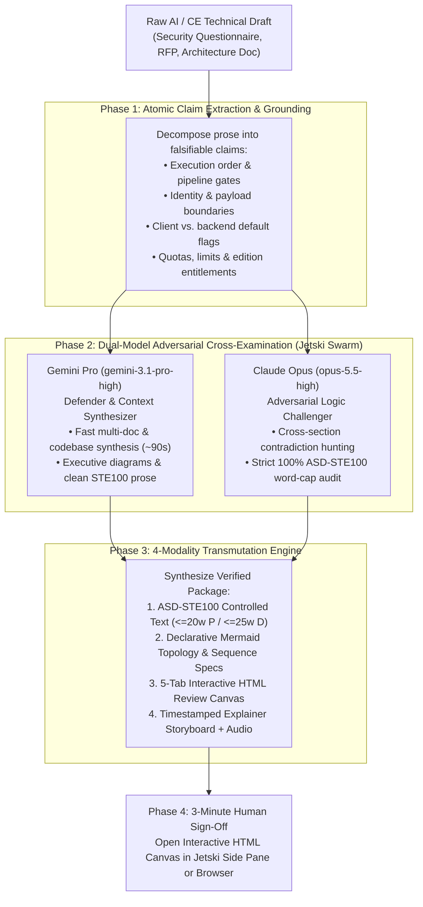

# Output AI Verification Loop (`output-engineer`)

> **Disclaimer**: This repository and its contents are provided for illustration and educational purposes only as example code. This is not an official Google product or officially supported Google Cloud project. This code is provided as-is for demonstration purposes and is NOT intended or supported for production workloads.

---

## Overview: What is Output Engineering?

While *prompt engineering* focuses on crafting input queries, **Output Engineering** is the deliberate transformation of AI-generated drafts into multi-modal, verifiable, and cognitively optimized representations.

When Customer Engineers (CEs), Solutions Architects, and Field Specialists use AI to draft complex security questionnaire responses, RFP answers, or architecture documents, subtle hallucinations and ordering inversions often hide inside dense walls of fluent prose. The **Output AI Verification Loop (`output-engineer` skill)** compresses a 30-minute line-by-line review into a **3-minute structural audit** by forcing AI drafts through **four deterministic output modalities** paired with a **Dual-Model Challenger-Defender Loop** (**Gemini Pro** + **Claude Opus**):

1. **Modality 1 — Writing (ASD-STE100 Controlled Technical English at ~80% Strictness):**
   - Rewrites explanations into **Simplified Technical English (ASD-STE100)**: Descriptive sentences $\le 25$ words, Procedural steps $\le 20$ words starting with an imperative verb, active voice only, one term per concept, and zero AI filler.
2. **Modality 2 — Diagrams (Declarative Mermaid.js Architecture & Sequence Models):**
   - Automatically maps narrative claims into `flowchart LR` trust-boundary diagrams (Zone 1 / Zone 2 / Zone 3) and chronological `sequenceDiagram` gate flows, exposing missing hops or ordering contradictions immediately.
3. **Modality 3 — Web Pages (Interactive HTML Review Canvas):**
   - Packages the audit into a self-contained, 5-tab **Interactive HTML Review Canvas** (`review_canvas_template.html`) that renders natively in the **Jetski / Antigravity** side pane or any desktop browser.
4. **Modality 4 — Explainer Videos & Narrated Storyboards:**
   - Generates a timestamped 2-minute visual storyboard (`00:00–02:00`) with an interactive scene stepper and built-in browser voice narration (`window.speechSynthesis`) so reviewers can listen to and inspect complex data flows step by step.

---

## Architecture: The Output Engineering Loop



---

## Repository Structure

```text
Output AI Verification Loop/
├── README.md                                  # This onboarding & architecture guide
├── install_skill.sh                           # One-command installer for Jetski / Antigravity
├── skill/
│   └── output-engineer/
│       ├── SKILL.md                           # Portable skill definition for Jetski / Antigravity
│       ├── references/
│       │   └── asd_ste100_quick_reference.md  # ASD-STE100 (~80% pragmatic) rules & examples
│       └── resources/
│           └── review_canvas_template.html    # Standardized 5-tab Interactive HTML Review Canvas template
├── scripts/
│   └── check_ste100.py                        # Deterministic Python validator for ASD-STE100 word caps
└── examples/
    ├── sample_security_review_canvas.html     # Populated 5-tab HTML Review Canvas (Sanitized Agency Audit)
    └── dual_model_benchmark_report.md         # Benchmark comparing Gemini 3.1 Pro vs. Claude Opus 5.5
```

---

## Quickstart for Coworkers Using Jetski / Antigravity

### Step 1: Install the `output-engineer` Skill

Clone the repository and run `install_skill.sh` to install the skill into `~/.gemini/config/skills/output-engineer` (and link `~/.gemini/skills/output-engineer`):

```bash
cd "projects/Output AI Verification Loop"
chmod +x install_skill.sh
./install_skill.sh
```

Or copy the skill folder manually:

```bash
mkdir -p ~/.gemini/config/skills/output-engineer
cp -R "skill/output-engineer/"* ~/.gemini/config/skills/output-engineer/
```

### Step 2: Run a Single-Model or Dual-Model Audit in Jetski / Antigravity

Open **Jetski** (`go/jetski`) or **Antigravity** and prompt the agent with your draft document, email thread, or Google Doc link:

#### Option A: Fast Single-Model Output Engineering Review (~90 seconds)
```text
Use the output-engineer skill to audit my technical response in <path-or-doc-link>.
Generate the 4 modalities (ASD-STE100 rewrite, Mermaid architecture/sequence diagrams,
5-tab Interactive HTML Review Canvas, and 2-minute explainer storyboard).
```

#### Option B: Dual-Model Challenger-Defender Benchmark (Gemini Pro + Claude Opus)
```text
Run the output-engineer skill on <path-or-doc-link> using a swarm with two workers:
1. gemini-pro (pinned to model "gemini-3.1-pro-high") as Context Synthesizer
2. claude-opus (pinned to model "opus-5.5-high") as Adversarial Logic Challenger
Compare their findings side-by-side and render the 5-tab Interactive HTML Review Canvas.
```

### Step 3: Validate ASD-STE100 Sentence Compliance

Run the included Python validator on any markdown rewrite to verify that every Procedural (`P`) sentence is $\le 20$ words, every Descriptive (`D`) sentence is $\le 25$ words, and zero banned filler phrases appear:

```bash
python3 scripts/check_ste100.py examples/dual_model_benchmark_report.md
```

---

## Previewing the Sample Interactive HTML Review Canvas

Open [`examples/sample_security_review_canvas.html`](./examples/sample_security_review_canvas.html) directly in your browser (or inside the Jetski Artifact side pane) to explore:
- **Tab 1 (`Claim & Red-Flag Inspector`):** Interactive filter and search across 14 high-impact architectural claims (`CONTRADICTED` vs. `NUANCE_REQUIRED`), comparing V1 Draft claims against production reality and required fixes.
- **Tab 2 (`Dual-Model Benchmark`):** Head-to-head comparison of **Gemini 3.1 Pro** (~92s synthesis, 5/5 core engineering fixes) vs. **Claude Opus 5.5** (43 atomic claims audited, +8 newly discovered cross-document contradictions).
- **Tab 3 (`Modality 1: ASD-STE100 Rewrite`):** Side-by-side "Before (39.9 words/sentence)" vs. "After (11.5 words/sentence, 100% compliant)" with per-sentence `[P]`/`[D]` and word-count badges plus one-click copy.
- **Tab 4 (`Modality 2: Architecture & Sequence Diagrams`):** Interactive Zone 1 / Zone 2 / Zone 3 trust boundary cards and copyable Mermaid.js source code.
- **Tab 5 (`Modality 4: Explainer Storyboard & Audio`):** 5-scene interactive walkthrough (`00:00–02:00`) with built-in Web Speech API (`▶ Speak Scene Narration`) audio playback.
