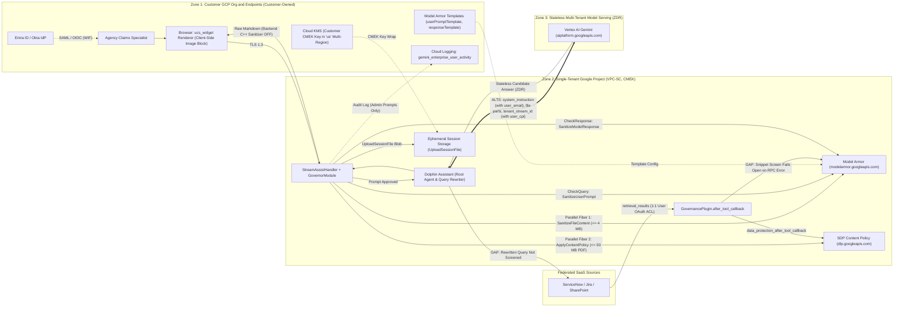

# Dual-Model Output Engineering Benchmark: Gemini Pro vs. Claude Opus

> **Disclaimer**: This benchmark and sample audit are provided for illustration and educational purposes only. All customer-identifying details, internal project IDs, and credentials have been sanitized.

---

## 1. Executive Summary

When Customer Engineers (CEs) and Solutions Architects use generative AI to draft complex security questionnaire responses or RFP narratives, subtle technical errors often hide inside fluent, verbose paragraphs.

This benchmark evaluates the **Output AI Verification Loop (`output-engineer` skill)** on a real-world **Public Sector Agency Security Architecture Review** (consisting of a 13-point security architecture email and 9 deep-dive Open Questions on **Gemini Enterprise**, **Model Armor**, and **Sensitive Data Protection**).

Using Jetski / Antigravity `swarm` orchestration, we ran the exact same Version 1 technical draft through two frontier models in parallel:
- **Model A (Context Synthesizer):** `gemini-3.1-pro-high` (Gemini Pro)
- **Model B (Adversarial Challenger):** `opus-5.5-high` (Claude Opus)

---

## 2. Head-to-Head Benchmark Results

| Evaluation Dimension | Gemini Pro (`gemini-3.1-pro-high`) | Claude Opus (`opus-5.5-high`) | Architectural Takeaway |
| :--- | :--- | :--- | :--- |
| **Execution Time** | **~92 seconds** (140 lines) | **~11 minutes** (535 lines + live doc/config verification) | **Gemini Pro** is ~7x faster for rapid synthesis; **Claude Opus** invests deep compute in adversarial verification. |
| **V1 Draft Scoring Calibration** | **Generous:** Logical Consistency `90/100`, Grounding `95/100`, STE100 `85/100` | **Forensic:** Logical Consistency `4.5/10`, Grounding `4.5/10`, STE100 `2.5/10` | **Claude Opus** measured V1's actual sentence length (39.9 words/sentence average; 78% over the 25-word ASD-STE100 cap) and penalized internal contradictions. |
| **Core Engineering Review Findings (5)** | **5 / 5 Caught** (`OQ-1` parallel fibers, `OQ-3(e)` `user_email` & `user_cpi`, `OQ-5` `ucs_widget`, `OQ-10` 5/8/20 caps & 600 RPM) | **5 / 5 Caught** + verified quota definitions & flag dependencies | **Tie** on known OQ discrepancies. |
| **Unprompted Contradictions Caught** | **0** beyond the 5 OQ findings (accepted the 13-point email's Workers' Comp SSN-masking narrative at face value) | **8 New Contradictions** across the 13-point email and Version 2 doc (see Section 3 below) | **Claude Opus** excelled as an adversarial red-team challenger. |
| **ASD-STE100 Rule Adherence** | **100% within word caps** (written as smooth multi-sentence paragraphs, ~11 words/sentence) | **100% within word caps** (141 sentences machine-verified with `[P]`/`[D]` & `[nw]` tags; 0 violations) | **Gemini Pro** reads more naturally for executive emails; **Claude Opus** is superior for line-by-line technical sign-off. |
| **Declarative Mermaid Diagrams** | Clean executive overview diagrams ready for customer slide decks | Detailed forensic diagrams with explicit `RED FLAG` edges and `par`/`alt` blocks | Complementary: **Gemini Pro** for customer presentation; **Claude Opus** for internal CE/SA architecture audit. |

---

## 3. Top 13 Technical Contradictions Surfaced by the Loop

### Part A: Core Engineering Discrepancies (Caught by Both Models)

1. **`OQ-1` — Parallel File Upload Fibers vs. Template Ordering:**
   - **V1 Claim:** Implied sequential Model Armor and SDP execution on file uploads.
   - **Production Reality:** Inside a single Model Armor template, **SDP runs first** followed by PI/JB/RAI classifiers. On session file uploads (`UploadSessionFile`), Model Armor (`SanitizeFileContent`, ≤ 4 MB) and SDP Content Policies (`ApplyContentPolicy`, ≤ 50 MB PDF / 30 MB Office) execute **concurrently in parallel fibers**.
2. **`OQ-3(e)` — `user_email` and `user_full_name` in `system_instruction`:**
   - **V1 Claim:** Stated that user email is stripped and never sent to Zone 3 model serving.
   - **Production Reality:** While raw Workforce Identity (SAML/OIDC) tokens, IAM group lists, and `Session` IDs are never sent as RPC credentials, **`user_email`** is injected into `system_instruction` for the Connector Query Rewrite sub-agent and root agent instructions, and **`user_full_name` + `user_email`** are injected into Agent Builder email sign-off instructions.
3. **`OQ-3(e)` — `cloud_principal_id` (`user_cpi`) in Request Extensions:**
   - **V1 Claim:** Described `tenant_stream_id` as an "opaque" correlation identifier.
   - **Production Reality:** `tenant_stream_id` embeds `gcp_<project_number>.cpi_<user_cpi>.class_unknown` for abuse detection and per-caller usage attribution.
4. **`OQ-5` — Client-Side Web UI (`ucs_widget`) vs. Backend C++ Markdown Sanitizer:**
   - **V1 Claim:** Attributed chat Markdown image stripping (``) to the backend C++ `MarkdownSanitizer`.
   - **Production Reality:** The backend `enable_in_backend` flag defaults to `false` on `StreamAssist` chat responses. External image blocking and link redirection (`google.com/url?q=`) are enforced **client-side in the Gemini Enterprise Web UI (`ucs_widget`)**, meaning custom API callers outside the Google web UI must block `` rendering in their own client.
5. **`OQ-10` — Multi-Layer Per-Turn Tool Caps (5 / 8 / 20) & Assistant vs. Search Quotas:**
   - **V1 Claim:** Cited only the outer 20 tool-turn limit and a "300 requests/minute/project" quota.
   - **Production Reality:** Production enforces **5** code-executor sandbox calls/turn, **8** root-agent thinking rounds, and **20** outer compositional tool turns; and the **Assistant** quota is **600 requests/min/project/region** (**1,800/min/org/region**), whereas **300/min** is the **Search** quota.

### Part B: 8 Additional Contradictions Caught by the Claude Opus Challenger Pass

6. **Email §2 vs. §13 Ordering Inversion & The Impossible Workers' Comp Upload Walkthrough:**
   - **V1 Claim:** Email §2 says Model Armor runs before SDP; §13 says SDP runs before Model Armor and claims that uploading a Workers' Comp PDF with an SSN results in SDP masking the SSN (`[SSN-MASKED]`) and continuing to inference.
   - **Production Reality:** On `UploadSessionFile`, a block verdict on `US_SOCIAL_SECURITY_NUMBER` **rejects the entire file upload**—there is no inline mask-and-continue path for session file uploads.
7. **Email §3 vs. `OQ-8` ("Raw Uploaded Files NEVER Transmitted to Zone 3"):**
   - **V1 Claim:** Email §3 states *"Elements NEVER transmitted to Zone 3: Raw uploaded files, binaries, images, or source PDF blobs."*
   - **Production Reality:** Contradicts `OQ-8`, which confirms that `GenerateContentRequest.contents[]` sent to Zone 3 includes *"any inline uploaded file parts"*.
8. **Email §5 Uses Non-Existent Built-In SDP `infoType` Names:**
   - **V1 Claim:** Lists `STATE_DRIVERS_LICENSE_NUMBER` and `US_INDIVIDUAL_TAX_IDENTIFIER (ITIN)` as built-in SDP detectors.
   - **Production Reality:** Neither identifier exists in Google Cloud SDP. The real built-in identifiers are `US_DRIVERS_LICENSE_NUMBER` and `US_INDIVIDUAL_TAXPAYER_IDENTIFICATION_NUMBER`.
9. **Email §7 & §8 Conflate CMEK Key Rotation / Disablement with Permanent Destruction:**
   - **V1 Claim:** Claims backups become undecryptable *"upon key rotation or deletion"* and that *"disabling or destroying"* a key makes data *"permanently unrecoverable"*.
   - **Production Reality:** Rotating a Cloud KMS key creates a new primary version while older versions stay enabled for decryption; disabling a key version is reversible; only *destroying* key versions is permanent.
10. **Email §9 Lists Single Regions (`us-central1`, `us-east4`) Instead of the `us` Multi-Region:**
    - **V1 Claim:** Instructs the customer to configure Gemini Enterprise in `us-central1`, `us-east4`, or `us-west1`.
    - **Production Reality:** Gemini Enterprise Data Residency (DRZ), CMEK, and Access Transparency are supported strictly in the **`us` and `eu` multi-regions** (and require disabling Grounding with Google Search).
11. **Email §12 vs. `OQ-8` (Audit Logs Capturing Model ID/Version):**
    - **V1 Claim:** Email §12 claims Cloud Audit Logs capture *"model ID/version, token metrics"*.
    - **Production Reality:** `gemini_enterprise_user_activity` audit logs for `StreamAssist` do **not** include a model version field.
12. **Residual Conflict in Version 2 (`OQ-8` vs. `OQ-3(e)`):**
    - **V2 Issue:** Even after updating `OQ-3(e)` to disclose `user_email` in `system_instruction`, `OQ-8` still stated that `system_instruction` *"Holds only the trusted agent instructions"*.
13. **Bundled Model Armor Quota Multiplier (`OQ-7`):**
    - **Nuance:** Model Armor is bundled *"up to the Assistant query quota"* (160 queries/user/day), but defense-in-depth snippet screening calls `SanitizeUserPrompt` **once per retrieved snippet**—meaning 1 Assistant query can trigger multiple Model Armor calls.

---

## 4. Modality 1: Sample ASD-STE100 Controlled Rewrite (100% Compliant)

Below is an excerpt of the machine-verified ASD-STE100 rewrite (`P` = Procedural ≤ 20 words; `D` = Descriptive ≤ 25 words):

### OQ-1 — What does Model Armor screen, and in what order do SDP and Model Armor run?
- **D** [17] Model Armor screens the user prompt, uploaded session files up to 4 MB, and the final response.
- **D** [17] SDP screens retrieved connector content and uploaded files up to 50 MB PDF or 30 MB Office.
- **D** [14] In production, Model Armor also screens retrieved snippets when the admin configures a `userPromptTemplate`.
- **D** [9] The snippet screen fails open on RPC transport errors.
- **D** [15] The prompt screen and the response screen fail closed only when the admin sets `failure_mode=FAIL_CLOSED`.
- **D** [18] Inside one Model Armor template, SDP runs first and the PI/JB, Malicious URI, and RAI filters run second.
- **D** [16] For a file upload, Model Armor and SDP run at the same time in parallel fibers.
- **D** [9] A block verdict from either service stops the file.
- **D** [9] The Assistant does not mask the file and continue.
- **P** [7] Set `failure_mode=FAIL_CLOSED` on each Model Armor template.
- **P** [10] Set `INSPECT_AND_BLOCK` for `US_SOCIAL_SECURITY_NUMBER` in Model Armor and in SDP.
- **P** [7] Configure a `userPromptTemplate` to activate snippet screening.

---

## 5. Modality 2: Declarative Mermaid.js Diagrams

### 5.1 Zone 1 / Zone 2 / Zone 3 Trust Boundary Flowchart

