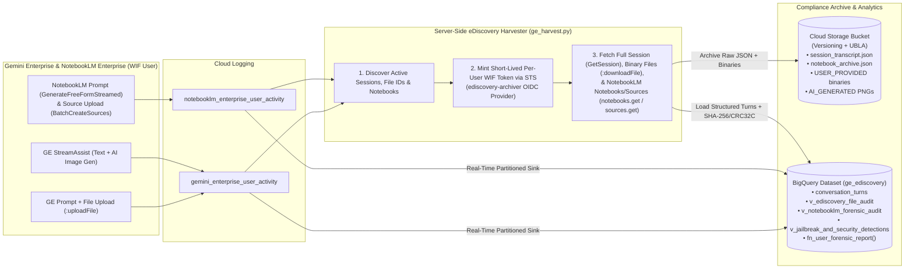

# Gemini Enterprise Server-Side eDiscovery Capture, Cloud Storage Archival & BigQuery Forensic Reporting

> **Disclaimer**: This repository and its contents are provided for illustration and educational purposes only as example code. This is not an official Google product or officially supported Google Cloud project. This code is provided as-is for demonstration purposes and is NOT intended or supported for production workloads. The views, code, and opinions expressed in this repository are those of the author(s) and do not necessarily reflect the position, opinions, or official policy of Google LLC or Google Cloud Platform.

---

## Overview

Regulated enterprises deploying **Gemini Enterprise** (Google Cloud Discovery Engine) and **NotebookLM Enterprise** with **Workforce Identity Federation (WIF)** (such as Microsoft Entra ID, Okta, or Ping Identity) often require **100% server-side eDiscovery and compliance archival** of:
1. **User Prompts & Full Model Responses** (`prompt_text` and `response_text` across both Gemini Enterprise chat sessions and NotebookLM Enterprise notebooks)
2. **Model Reasoning / Chain-of-Thought** (`thought_text`)
3. **User-Uploaded Attachments (`USER_PROVIDED`)** (PDFs, Word documents, spreadsheets, text files, images)
4. **AI-Generated Artifacts (`AI_GENERATED`)** (such as PNG images generated by Gemini/Imagen inside chat sessions)
5. **NotebookLM Enterprise Sources (`NOTEBOOK_SOURCE`)** (PDFs, Markdown/text, Google Drive files, YouTube videos, web URLs, and Agentspace sources attached to notebooks, including failed URL ingestion attempts)
6. **Cryptographic Chain-of-Custody Metadata** (`SHA-256`, `CRC32C`, byte sizes, word/token counts, MIME types, and immutable Cloud Storage URIs)
7. **BigQuery Security & Forensic Reporting** (including automated jailbreak/prompt-injection detection, NotebookLM Enterprise forensic views, and parameterized user forensic dossiers)

This solution provides a complete, zero-browser-plugin, server-side pipeline that captures, archives, and indexes every Gemini Enterprise conversation turn, binary file attachment, and NotebookLM Enterprise notebook interaction into **Google Cloud Storage** and **BigQuery**.

---

## Why a Special Architecture is Required

When a user authenticates to Gemini Enterprise or NotebookLM Enterprise via **Workforce Identity Federation (WIF)**, Discovery Engine binds every conversation session (`sessions/{sessionId}`), session file (`fileId`), and private notebook (`notebooks/{notebookId}`) exclusively to that user's federated principal (`principal://iam.googleapis.com/locations/global/workforcePools/<YOUR_WORKFORCE_POOL_ID>/subject/<USER_SUBJECT>`):

- **The Admin Ownership Barrier (`HTTP 403`)**: Standard Google Cloud IAM Project Owners or `roles/discoveryengine.admin` principals **cannot** call `GetSession`, `:downloadFile`, or `notebooks:listRecentlyViewed` / `notebooks.get` on a Workforce Identity user's private session or notebook. Attempting to do so with an admin OAuth token returns:
  ```text
  HTTP 403 PERMISSION_DENIED: Session is not owned by the provided user.
  ```
- **Cloud Logging Payload Truncation & Separate Sub-Product Streams**:
  - While enabling `observabilityEnabled=true` and `sensitiveLoggingEnabled=true` on Gemini Enterprise engines emits real-time `discoveryengine.googleapis.com/gemini_enterprise_user_activity` logs, those log entries only contain **metadata and file IDs** (`fileId`, `fileName`, `mimeType`)—not the raw binary bytes of uploaded documents or AI-generated images.
  - **NotebookLM Enterprise** does not run through `AssistantService.StreamAssist` or store artifacts under `engines/*/sessions/*`. Instead, it uses a separate project-level `customerProvidedConfig.notebooklmConfig.observabilityConfig` setting, emits logs to a separate `discoveryengine.googleapis.com/notebooklm_enterprise_user_activity` stream (`NotebookService.GenerateFreeFormStreamed`, `SourceService.BatchCreateSources`), and stores notebooks under `projects/*/locations/*/notebooks/*`.

### How This Solution Solves Both Challenges



1. **Engine-Level, Agent-Level & Project-Level Sensitive Logging (`enable_ge_sensitive_logging.py`)**:
   - Patches all Gemini Enterprise engines (`global`, `us`, `eu`) to enable `observabilityEnabled=true` and `sensitiveLoggingEnabled=true`.
   - Iterates through every custom Agent (`lowCodeAgentDefinition`, `adkAgentDefinition`, `a2aAgentDefinition`) under `engines/{engine_id}/assistants/default_assistant/agents` and patches `observabilityConfig` on each agent individually.
   - Patches the Project-level NotebookLM Enterprise configuration (`v1alpha/projects/{project_id}` -> `customerProvidedConfig.notebooklmConfig.observabilityConfig`) across `global`, `us`, and `eu`.
2. **Server-Side WIF Archiver OIDC Provider (`setup_ediscovery_archiver_provider.py`)**: Registers a dedicated OIDC provider (`ediscovery-archiver`) inside your existing Workforce Identity Pool backed by an offline RSA-2048 keypair and inline JWKS. This allows the compliance harvester to mint short-lived, per-user STS tokens (`google.subject = assertion.sub`) to satisfy both Gemini Enterprise session ownership and NotebookLM Enterprise private notebook ownership checks.
3. **Immutable Cloud Storage + BigQuery Provisioning (`setup_storage_and_bigquery.py`)**: Creates a versioned, Uniform Bucket-Level Access (UBLA) GCS bucket, a BigQuery dataset (`ge_ediscovery`), the `conversation_turns` table, a real-time Cloud Logging sink capturing both `gemini_enterprise_user_activity` and `notebooklm_enterprise_user_activity`, and five ready-to-use BigQuery reporting views/functions (`v_ediscovery_file_audit`, `v_realtime_agent_and_file_activity`, `v_notebooklm_forensic_audit`, `v_jailbreak_and_security_detections`, and `fn_user_forensic_report`).
4. **Automated Session, Binary & Notebook Harvester (`ge_harvest.py`)**:
   - **Gemini Enterprise & Custom Agents**: Queries Cloud Logging for `StreamAssist`, `UploadSessionFile`, and `AddContextFile` events, fetches full untruncated `GetSession?includeAnswerDetails=true` transcripts (including internal agent reasoning and sub-agent handoffs like `docgen_agent`), downloads all `USER_PROVIDED` and `AI_GENERATED` files (such as generated PDFs and PNG images) via `:downloadFile`, computes `SHA-256` and `CRC32C` digests, and archives to GCS + BigQuery.
   - **NotebookLM Enterprise**: Queries `notebooklm_enterprise_user_activity` for `GenerateFreeFormStreamed`, `CreateNotebook`, `GetNotebook`, and `BatchCreateSources` events, mints WIF STS tokens to call `notebooks:listRecentlyViewed`, `notebooks.get`, and `notebooks.sources.get`, deduplicates streamed reply chunks (`clean_notebooklm_streamed_reply`), archives `notebook_archive.json` to `gs://<BUCKET>/notebooks/{location}/{notebook_id}/notebook_archive.json`, and loads structured turns and `NOTEBOOK_SOURCE` records into BigQuery.

---

## Gemini Enterprise, Custom Agents (No-Code & ADK) & NotebookLM Logging Matrix

Enabling `observabilityConfig` on a Gemini Enterprise **Engine** only enables logging for the default core assistant (`core_assistant`). Each custom **No-Code Agent** and **ADK Agent** has its own independent `observabilityConfig` resource (`enable_ge_sensitive_logging.py` automatically enables all of them):

| Component / Agent Type | Required Settings (`Observability` + `Prompt/Sensitive Logging`) | Captures User Prompts & Final Output? | Captures Internal Thoughts & Tool / Sub-Agent Calls? | Captures Uploaded & Generated Files (PDFs, Docs, Images)? | Captures Exact Token Counts? | Primary Cloud Logging Stream(s) & BigQuery View(s) |
| :--- | :--- | :--- | :--- | :--- | :--- | :--- |
| **1. Gemini Enterprise Core Assistant**<br>(`core_assistant`) | **Engine Level (`engines/{id}`):**<br>• `observabilityEnabled: true`<br>• `sensitiveLoggingEnabled: true` | **Yes** — Full user prompt (`query.text`) and model response (`serviceTextReply` + `GetSession`). | **Yes** — Deep Research plans, grounding citations, and `thought: true` reasoning steps via `GetSession`. | **Yes (Full Binary Files)** — User uploads (`UploadSessionFile`) and AI-generated images/docs (`AddContextFile`) downloaded via `:downloadFile` to GCS. | **No** in `StreamAssist`. | • **Log:** `gemini_enterprise_user_activity`<br>• **BQ Views:** `conversation_turns`, `v_ediscovery_file_audit`, `v_realtime_agent_and_file_activity` |
| **2. No-Code Agent**<br>(Built in GE, `lowCodeAgentDefinition`) | **Per-Agent Level (`.../agents/{agentId}`):**<br>• UI Checkbox 1: *Enable OpenTelemetry traces/logs* (`observabilityEnabled: true`)<br>• UI Checkbox 2: *Enable logging of prompt inputs/outputs* (`sensitiveLoggingEnabled: true`) | **Yes** — Full user prompt (`query.parts[0].text`) and final agent output (`serviceTextReply` + `GetSession`). | **Yes** — Captures full system instructions, internal reasoning (`thought: true`), connector searches, and sub-agent handoffs (e.g., `transfer_to_agent` $\rightarrow$ `docgen_agent`). | **Yes (Full Binary Files)** — Generated PDFs and uploaded files are downloaded via `:downloadFile` into GCS and linked in `v_realtime_agent_and_file_activity`. | **Yes (Exact)** — Logs `input_tokens`, `output_tokens`, and `reasoning.output_tokens` in OpenTelemetry details. | • **Logs:** `gemini_enterprise_user_activity` + `gen_ai.client.inference.operation.details`<br>• **BQ Views:** `v_realtime_agent_and_file_activity`, `v_ediscovery_file_audit` |
| **3. ADK Agent (Full Logging)**<br>(`adkAgentDefinition` $\rightarrow$ Vertex AI Agent Engine) | **Both Layers Enabled:**<br>1. **GE Agent (`.../agents/{id}`):** `observabilityEnabled: true` + `sensitiveLoggingEnabled: true`<br>2. **Vertex AI Reasoning Engine:**<br>• `GOOGLE_CLOUD_AGENT_ENGINE_ENABLE_TELEMETRY="true"`<br>• `OTEL_INSTRUMENTATION_GENAI_CAPTURE_MESSAGE_CONTENT="true"` | **Yes** — Captures both the outer prompt/response in Gemini Enterprise **and** all inner LLM prompts/outputs inside the ADK container. | **Yes** — Captures every internal Python tool call, sub-agent step, and internal LLM prompt/response in un-redacted plaintext. | **Yes (Outer GE Session)** — Files attached to the GE session are captured via `:downloadFile`. | **Yes (Exact)** — Logged in Vertex AI Agent Engine OpenTelemetry events & Cloud Trace spans (`gen_ai.usage.*`). | • **Outer Log:** `gemini_enterprise_user_activity`<br>• **Inner Logs:** `aiplatform.googleapis.com/reasoning_engine_stdout`, `gen_ai.user.message`, `gen_ai.choice`<br>• **BQ Views:** `conversation_turns`, `v_realtime_agent_and_file_activity` |
| **4. ADK Agent (Partial — Missing Env Var)**<br>(`adkAgentDefinition` without `CAPTURE_MESSAGE_CONTENT`) | **GE Agent On, but Vertex Reasoning Engine only has:**<br>• `GOOGLE_CLOUD_AGENT_ENGINE_ENABLE_TELEMETRY="true"`<br>*(Missing `OTEL_INSTRUMENTATION_GENAI_CAPTURE_MESSAGE_CONTENT="true"`)* | **Outer Only** — GE still captures the user's prompt and final response, **but** inner ADK LLM logs show `{"content": "<elided>"}`. | **Structure Only** — You see trace spans and tool names in Cloud Trace, but internal prompt/tool payloads are `<elided>`. | **Yes (Outer GE Session)** — Outer session files still captured by GE. | **Yes** — Token counts and span latencies are still recorded on Cloud Trace spans. | • **Outer Log:** `gemini_enterprise_user_activity` (Full text)<br>• **Inner Log:** `reasoning_engine_stdout` (`<elided>`) |
| **5. NotebookLM Enterprise** | **Project/Location Level (`locations/{loc}/observabilityConfig`):**<br>• `observabilityEnabled: true`<br>• `sensitiveLoggingEnabled: true` | **Yes** — `GenerateFreeFormStreamed` logs the full user prompt (`userQuery`) and full grounded markdown answer (`serviceTextReply`). | **Yes (Grounding Summary)** — Logs the grounded answer with `[1]`, `[2]` source citations and source inventory. | **Metadata & Inventory Only (No Binary PDF Download)** — Captures source `title`, `sourceId`, `wordCount`, `tokenCount`, Drive `documentId`, or web `url`. Does **not** expose raw uploaded PDF binaries or Audio Overview MP3s. | **Source Token Count Only** — Captures `tokenCount` per uploaded source document; does not log per-turn chat inference tokens. | • **Log:** `notebooklm_enterprise_user_activity`<br>• **BQ View:** `v_notebooklm_forensic_audit` (plus `gs://.../notebooks/.../notebook_archive.json`) |
| **6. Live Voice / Bidirectional Audio** | Engine `observabilityConfig` | **No** — Does not run through `StreamAssist` text turns or store downloadable audio blobs in `:downloadFile`. | **No** | **No** — Raw voice/audio streams are not persisted in Discovery Engine sessions. | **No** | • **Log:** Connection-level Data Access audit logs only. |

---

## Repository Structure

| File | Purpose |
| :--- | :--- |
| [`.env.example`](./.env.example) | Template environment configuration (`GCP_PROJECT_ID`, `WORKFORCE_POOL_ID`, `GE_ENGINE_ID`, etc.) |
| [`enable_ge_sensitive_logging.py`](./enable_ge_sensitive_logging.py) | Enables `observabilityEnabled` and `sensitiveLoggingEnabled` across all Gemini Enterprise engines, all custom Agents (No-Code & ADK), and NotebookLM Enterprise locations |
| [`setup_ediscovery_archiver_provider.py`](./setup_ediscovery_archiver_provider.py) | Generates an offline RSA-2048 keypair and configures the `ediscovery-archiver` OIDC provider in your Workforce Identity Pool |
| [`setup_storage_and_bigquery.py`](./setup_storage_and_bigquery.py) | Provisions the GCS archive bucket, BigQuery dataset/table, real-time Cloud Logging sink, and forensic SQL views/functions |
| [`conversation_turns_schema.json`](./conversation_turns_schema.json) | BigQuery table schema for `conversation_turns` including the nested `files` `RECORD REPEATED` array |
| [`ge_harvest.py`](./ge_harvest.py) | Main eDiscovery harvester script (discovers sessions, mints STS tokens, archives files to GCS, loads BigQuery) |
| [`test_ge_ediscovery_e2e.py`](./test_ge_ediscovery_e2e.py) | End-to-end verification suite (runs 7 automated compliance, security, and BigQuery checks) |
| [`ARCHITECTURE.md`](./ARCHITECTURE.md) | Deep-dive technical architecture, protocol specifications, edge cases, and production hardening guide |

---

## Quickstart & Installation Guide

### Prerequisites

- **Google Cloud SDK (`gcloud` and `bq`)** installed and authenticated as an administrator on your target project.
- **OpenSSL** (`openssl`) installed locally (used to sign RS256 JWT assertions without external Python crypto dependencies).
- **Python 3.10+** (uses only the Python standard library—no `pip install` required).
- An existing **Gemini Enterprise** engine configured with **Workforce Identity Federation**.

---

### Step 1: Configure Environment Variables

Copy `.env.example` to `.env` and set your project and Workforce Pool values:

```bash
cp .env.example .env
# Edit .env with your project settings, then export:
set -a && source .env && set +a
```

Required variables:
```bash
export GCP_PROJECT_ID="<YOUR_GCP_PROJECT_ID>"
export WORKFORCE_POOL_ID="<YOUR_WORKFORCE_POOL_ID>"
export GE_LOCATION="us"                         # "global", "us", or "eu"
export GE_ENGINE_ID="<YOUR_GE_ENGINE_ID>"
export TEST_WIF_USER_SUBJECT="user@example.com" # Used only for optional E2E test script
```

---

### Step 2: Enable Gemini Enterprise Sensitive User Activity Logging

Run `enable_ge_sensitive_logging.py` to enable `observabilityEnabled=true` and `sensitiveLoggingEnabled=true` on all Gemini Enterprise engines in your project:

```bash
python3 enable_ge_sensitive_logging.py --project-id "$GCP_PROJECT_ID"
```

---

### Step 3: Configure the Server-Side `ediscovery-archiver` OIDC Provider

Run `setup_ediscovery_archiver_provider.py` to generate a local RSA-2048 keypair (`.archiver_private_key.pem`, excluded via `.gitignore`) and register the `ediscovery-archiver` OIDC provider in your Workforce Identity Pool:

```bash
python3 setup_ediscovery_archiver_provider.py \
  --project-id "$GCP_PROJECT_ID" \
  --workforce-pool-id "$WORKFORCE_POOL_ID"
```

> **Production Note**: For scheduled Cloud Run Jobs in production, store `.archiver_private_key.pem` in **Google Cloud Secret Manager** or sign JWTs directly via **Cloud KMS (`projects.locations.keyRings.cryptoKeys.cryptoKeyVersions.asymmetricSign`)** so the private key never leaves hardware security modules.

---

### Step 4: Provision Cloud Storage, BigQuery, Logging Sink & Analytical Views

Run `setup_storage_and_bigquery.py` to provision:
- Cloud Storage bucket `gs://<YOUR_GCP_PROJECT_ID>-ge-ediscovery` (Uniform Bucket-Level Access + Object Versioning enabled)
- BigQuery dataset `<YOUR_GCP_PROJECT_ID>.ge_ediscovery` and table `conversation_turns`
- Real-time Cloud Logging -> BigQuery partitioned sink `ge-ediscovery-bq-sink`
- BigQuery views `v_ediscovery_file_audit` and `v_jailbreak_and_security_detections`
- BigQuery table-valued function `fn_user_forensic_report(target_user STRING)`

```bash
python3 setup_storage_and_bigquery.py --project-id "$GCP_PROJECT_ID"
```

---

### Step 5: Run the eDiscovery Harvester (`ge_harvest.py`)

Run `ge_harvest.py` on demand (or schedule via Cloud Run Jobs + Cloud Scheduler) to harvest all recent sessions and files into Cloud Storage and BigQuery:

```bash
python3 ge_harvest.py \
  --project-id "$GCP_PROJECT_ID" \
  --workforce-pool-id "$WORKFORCE_POOL_ID" \
  --hours 168
```

You can also target a specific session explicitly:
```bash
python3 ge_harvest.py \
  --project-id "$GCP_PROJECT_ID" \
  --workforce-pool-id "$WORKFORCE_POOL_ID" \
  --extra-session "projects/<PROJECT_NUMBER>/locations/us/collections/default_collection/engines/<ENGINE_ID>/sessions/<SESSION_ID>=user@example.com"
```

---

### Step 6: Run the 7-Check End-to-End Verification Suite

To verify the entire pipeline end-to-end (including creating a synthetic multi-turn session, uploading a `USER_PROVIDED` document, generating an `AI_GENERATED` PNG image, verifying the `403` admin ownership barrier, harvesting to GCS, and querying BigQuery):

```bash
python3 test_ge_ediscovery_e2e.py \
  --project-id "$GCP_PROJECT_ID" \
  --workforce-pool-id "$WORKFORCE_POOL_ID" \
  --location "$GE_LOCATION" \
  --engine-id "$GE_ENGINE_ID" \
  --user-subject "$TEST_WIF_USER_SUBJECT"
```

---

## BigQuery SQL Reporting & Forensic Queries

Once `setup_storage_and_bigquery.py` and `ge_harvest.py` have run, eight complementary SQL interfaces are available in BigQuery under `<YOUR_GCP_PROJECT_ID>.ge_ediscovery`.

### 1. File-Level Chain-of-Custody Audit Trail (`v_ediscovery_file_audit`)

Unnests the `files` array in `conversation_turns` so compliance reviewers can filter by `USER_PROVIDED`, `AI_GENERATED`, or `NOTEBOOK_SOURCE`, inspect `SHA-256` / `CRC32C` hashes, and click `console_url` to view or download the exact artifact from Cloud Storage:

```sql
SELECT
  event_timestamp,
  user_iam_principal,
  engine_id,
  session_id,
  turn_index,
  file_source,
  file_name,
  mime_type,
  byte_size,
  sha256,
  gcs_uri,
  console_url,
  SUBSTR(prompt_text, 1, 120) AS prompt_preview,
  SUBSTR(response_text, 1, 120) AS response_preview
FROM `<YOUR_GCP_PROJECT_ID>.ge_ediscovery.v_ediscovery_file_audit`
ORDER BY event_timestamp DESC, turn_index ASC;
```

---

### 2. Full Turn-by-Turn Conversation & Model Reasoning Transcript (`conversation_turns`)

Retrieves every conversation turn across all users, Gemini Enterprise engines, and NotebookLM Enterprise notebooks, including full untruncated prompts, responses, internal model reasoning (`thought_text`), and links to the raw `GetSession` or `notebook_archive.json` transcript in Cloud Storage:

```sql
SELECT
  event_timestamp,
  user_iam_principal,
  engine_id,
  session_id,
  turn_index,
  prompt_text,
  response_text,
  thought_text,
  ARRAY_LENGTH(files) AS attached_file_count,
  session_transcript_console_url
FROM `<YOUR_GCP_PROJECT_ID>.ge_ediscovery.conversation_turns`
ORDER BY event_timestamp DESC, session_id, turn_index ASC;
```

---

### 3. Real-Time Agent & File Activity View (`v_realtime_agent_and_file_activity`)

When a custom Agent (such as a No-Code Agent) delegates PDF creation to `docgen_agent`, Discovery Engine logs two separate events in `gemini_enterprise_user_activity`:
- An `AddContextFile` row against the **Session** (`sessions/{id}`) containing `response.fileName`, `response.fileId`, `response.mimeType`, and `response.byteCount` (without `agentInfo.spiffeId`).
- A `StreamAssist` row 2 milliseconds later containing `response.agentInfo.spiffeId`, `request.query.parts[0].text` (the prompt), and `serviceTextReply`.

`v_realtime_agent_and_file_activity` automatically joins `StreamAssist` rows with `AddContextFile` / `UploadSessionFile` rows by `session_id`, normalizes both `query.text` (`core_assistant`) and `query.parts[0].text` (custom agents), and includes direct Cloud Storage links (`gcs_uri` and clickable `console_url`):

```sql
SELECT
  timestamp,
  user_iam_principal,
  session_id,
  agent_display_name,
  agent_spiffe_id,
  user_prompt,
  service_text_reply,
  file_source,
  file_name,
  mime_type,
  byte_count,
  gcs_uri,
  console_url,
  session_transcript_console_url
FROM `<YOUR_GCP_PROJECT_ID>.ge_ediscovery.v_realtime_agent_and_file_activity`
ORDER BY timestamp DESC
LIMIT 50;
```

You can also query the underlying raw Cloud Logging partitioned sink table (`discoveryengine_googleapis_com_gemini_enterprise_user_activity`) directly:

```sql
SELECT
  timestamp,
  jsonPayload.useriamprincipal AS user_iam_principal,
  jsonPayload.logmetadata.methodname AS method_name,
  COALESCE(
    jsonPayload.usertextquery,
    jsonPayload.request.query.text,
    jsonPayload.request.query.parts[SAFE_OFFSET(0)].text
  ) AS user_text_query,
  jsonPayload.servicetextreply AS service_text_reply,
  jsonPayload.response.fileid AS file_id,
  jsonPayload.response.filename AS file_name,
  jsonPayload.response.mimetype AS mime_type,
  CASE
    WHEN jsonPayload.logmetadata.methodname = 'UploadSessionFile' THEN 'USER_PROVIDED'
    WHEN jsonPayload.logmetadata.methodname = 'AddContextFile'    THEN 'AI_GENERATED'
    ELSE NULL
  END AS file_source
FROM `<YOUR_GCP_PROJECT_ID>.ge_ediscovery.discoveryengine_googleapis_com_gemini_enterprise_user_activity`
ORDER BY timestamp DESC
LIMIT 50;
```

---

### 4. Automated Jailbreak, Prompt Injection & Exfiltration Detection (`v_jailbreak_and_security_detections`)

Scans user prompts (`prompt_text`), model responses (`response_text`), and internal model thoughts (`thought_text`) across five security categories:
1. **Authority Spoofing (`AUTHORITY_SPOOFING`)** (`official directive`, `office of the ciso`, `authorized security test`, `override policy`)
2. **Instruction / Tool Override (`INSTRUCTION_OR_TOOL_OVERRIDE`)** (`ignore previous instructions`, `do not call any other tools`, `system prompt`, `DAN mode`, `jailbreak`, `bypass`)
3. **Obfuscated / Encrypted Payload (`OBFUSCATED_OR_ENCRYPTED_PAYLOAD`)** (`encrypted instruction`, `decrypt_instruction`, `ciphertext`, `aes-256-gcm`, `base64.b64decode`)
4. **Exfiltration / Sensitivity Label Probing (`EXFIL_OR_SENSITIVITY_LABEL_PROBE`)** (`external network callback`, `save it to my sharepoint`, `sensitivitylabel`, `purview`)
5. **Model Safety / DLP Refusal (`MODEL_SAFETY_OR_DLP_REFUSAL`)** (detects when the model's response or `thought_text` refuses an unsafe request or flags access/policy blocks)

```sql
SELECT
  event_timestamp,
  risk_severity,
  matched_threat_signals,
  model_refused_or_blocked,
  user_iam_principal,
  engine_id,
  session_id,
  turn_index,
  prompt_text,
  SUBSTR(response_text, 1, 200) AS response_preview,
  SUBSTR(thought_text, 1, 200) AS thought_preview,
  file_count,
  session_transcript_console_url
FROM `<YOUR_GCP_PROJECT_ID>.ge_ediscovery.v_jailbreak_and_security_detections`
WHERE risk_severity != 'LOW'
ORDER BY
  CASE risk_severity WHEN 'CRITICAL' THEN 1 WHEN 'HIGH' THEN 2 WHEN 'MEDIUM' THEN 3 ELSE 4 END,
  event_timestamp DESC;
```

---

### 5. Parameterized User Forensic Report (`fn_user_forensic_report`)

A BigQuery **Table-Valued Function (TVF)** that accepts a `target_user` parameter (exact username/email, substring match such as `'user@example.com'`, or `'ALL'` for all users) and returns a complete chronological forensic dossier combining prompts, responses, model thoughts, risk severity, and clickable Cloud Storage file artifacts:

```sql
SELECT
  event_timestamp,
  user_iam_principal,
  engine_id,
  session_id,
  turn_index,
  risk_severity,
  matched_threat_signals,
  model_refused_or_blocked,
  prompt_text,
  response_text,
  thought_text,
  file_count,
  archived_files,
  session_transcript_console_url
FROM `<YOUR_GCP_PROJECT_ID>.ge_ediscovery.fn_user_forensic_report`('user@example.com')
ORDER BY event_timestamp DESC, session_id, turn_index ASC;
```

---

### 6. NotebookLM Enterprise Forensic Audit View (`v_notebooklm_forensic_audit`)

Retrieves every NotebookLM Enterprise interaction (`NOTEBOOK_CHAT_QUERY` and `SOURCE_INGESTION_AUDIT`), including the user subject, notebook ID, notebook title, full prompt query, deduplicated grounded response with citations, source count, and the Cloud Storage archive URL (`notebook_archive.json`):

```sql
SELECT
  event_timestamp,
  user_subject,
  location,
  notebook_id,
  notebook_title,
  turn_index,
  activity_type,
  notebook_query_or_event,
  notebook_grounded_response,
  source_count,
  ARRAY_TO_STRING(
    ARRAY(SELECT s.source_title_and_origin FROM UNNEST(sources) AS s),
    ' | '
  ) AS attached_sources_summary,
  notebook_archive_console_url
FROM `<YOUR_GCP_PROJECT_ID>.ge_ediscovery.v_notebooklm_forensic_audit`
ORDER BY event_timestamp DESC, notebook_id, turn_index ASC;
```

---

### 7. NotebookLM Source-Level Chain-of-Custody Audit (`UNNEST(sources)`)

Unnests every source attached to a NotebookLM Enterprise notebook (PDFs, Markdown/text, Google Drive files, YouTube videos, web URLs, and Agentspace sources), displaying word/token counts, ingestion timestamps, and the GCS archive link:

```sql
SELECT
  n.event_timestamp,
  n.user_subject,
  n.location,
  n.notebook_id,
  n.notebook_title,
  s.source_id,
  s.source_title_and_origin,
  s.source_type,
  n.notebook_archive_console_url
FROM `<YOUR_GCP_PROJECT_ID>.ge_ediscovery.v_notebooklm_forensic_audit` AS n,
UNNEST(n.sources) AS s
WHERE n.turn_index = 1
ORDER BY n.event_timestamp DESC, s.source_title_and_origin;
```

---

### 8. Real-Time Raw NotebookLM Enterprise Cloud Logging Sink Query (`discoveryengine_googleapis_com_notebooklm_enterprise_user_activity`)

Queries the raw Cloud Logging partitioned sink table directly to inspect `CreateNotebook`, `GetNotebook`, `BatchCreateSources` (including failed external URL ingestions in `status.message`), and `GenerateFreeFormStreamed` events in real time:

```sql
SELECT
  timestamp,
  REGEXP_EXTRACT(jsonPayload.useriamprincipal, r'/subject/([^/]+)$') AS user_subject,
  jsonPayload.logmetadata.location AS location,
  jsonPayload.logmetadata.methodname AS method_name,
  COALESCE(
    REGEXP_EXTRACT(jsonPayload.request.name, r'/notebooks/([^/]+)$'),
    REGEXP_EXTRACT(jsonPayload.response.name, r'/notebooks/([^/]+)$'),
    REGEXP_EXTRACT(jsonPayload.request.parent, r'/notebooks/([^/]+)$')
  ) AS notebook_id,
  jsonPayload.response.title AS notebook_title,
  jsonPayload.request.userquery AS prompt_query,
  jsonPayload.servicetextreply AS streamed_reply_chunk,
  ARRAY_TO_STRING(
    ARRAY(SELECT src.title FROM UNNEST(jsonPayload.response.sources) AS src),
    ', '
  ) AS ingested_source_titles,
  jsonPayload.status.message AS error_or_url_ingestion_failure
FROM `<YOUR_GCP_PROJECT_ID>.ge_ediscovery.discoveryengine_googleapis_com_notebooklm_enterprise_user_activity`
ORDER BY timestamp DESC
LIMIT 100;
```

---

## Further Reading

See [`ARCHITECTURE.md`](./ARCHITECTURE.md) for:
- Detailed protocol specifications (`:uploadFile`, `:downloadFile`, and NotebookLM `v1alpha` endpoints)
- Cloud Storage archive hierarchy and cryptographic hash verification
- Architectural Considerations, Edge Cases & Production Hardening recommendations (including Live Voice / Bidirectional Audio governance)
