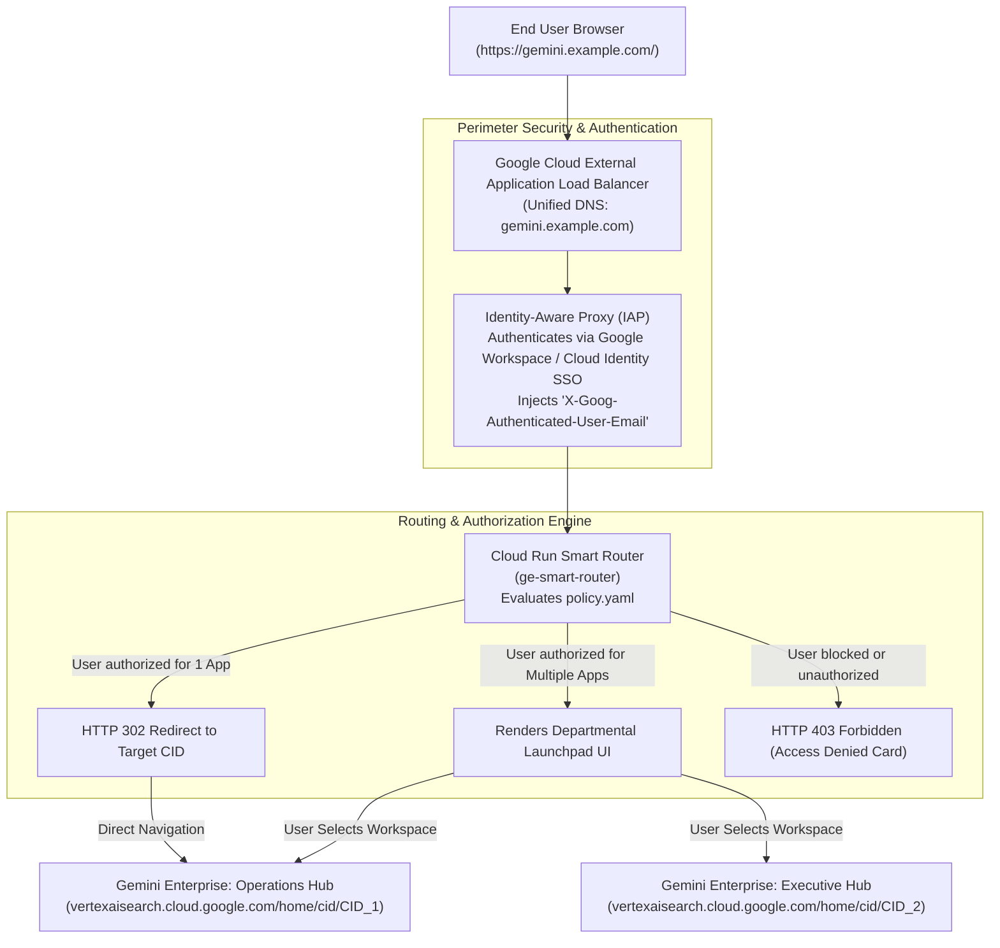

# Gemini Enterprise Smart Group Router

> An enterprise reference architecture for serving multiple **Gemini Enterprise** applications under a **single unified DNS domain**, routing users to their authorized application based on **Google Cloud Identity / Google Workspace group membership**.

> **Disclaimer**: This repository and its contents are provided for illustration and educational purposes only as example code. This is not an official Google product or officially supported Google Cloud project. This code is provided as-is for demonstration purposes and is NOT intended or supported for production workloads. The views, code, and opinions expressed in this repository are those of the author(s) and do not necessarily reflect the position, opinions, or official policy of Google LLC or Google Cloud Platform.

---

## 📌 Problem Overview

Enterprises deploying **Gemini Enterprise** frequently establish separate applications / engines for distinct business units (e.g., HR, Finance & Legal, Engineering, Executive Operations) to enforce strict data store isolation and compliance perimeters.

However, organizations face a key architectural challenge:
- End-users require a **single, unified entry point** (e.g., `https://gemini.example.com/`).
- Standard Google Cloud Application Load Balancer (ALB) URL maps route based on hostname, path, or raw HTTP headers. The user's browser does not send group membership in request headers.
- **Identity-Aware Proxy (IAP)** validates identity at the Backend Service level, but cannot natively dynamically switch backend destinations for the same URL path without a routing dispatcher.

---

## 🏗️ Architecture

The **Smart Router** architecture couples a Google Cloud External Application Load Balancer, Identity-Aware Proxy (IAP), and a lightweight serverless routing dispatcher running on **Cloud Run**.



### Routing Behavior:
1. **Single Authorized App**: The user navigates to `https://gemini.example.com/`. The router detects they are authorized for exactly one workspace and issues an **instant HTTP 302 redirect** directly to that Gemini Enterprise instance. Zero extra clicks.
2. **Multi-App Users**: If a user has access to multiple departmental workspaces (e.g., Operations and Executive), the router renders a responsive, branded **Enterprise Launchpad** presenting only the workspaces they are permitted to access.
3. **Deep-Link Security Guard**: If a user attempts to manually navigate to an unauthorized instance URL (e.g., `/app/<RESTRICTED_CID>`), the router intercepts the request, generates a security audit log, and returns a custom **HTTP 403 Forbidden Access Denied** page.

---

## 📂 Project Structure

```
ge-smart-router/
├── Dockerfile                  # Container definition for Cloud Run
├── README.md                   # Architecture documentation and guides
├── deploy.sh                   # One-click Cloud Run deployment script
├── main.py                     # FastAPI routing engine and IAP header validator
├── policy.yaml                 # Declarative instance mapping & RBAC policy
├── requirements.txt            # Python dependencies
├── test_router.py              # Automated unit tests for routing & security logic
├── templates/
│   ├── forbidden.html          # Custom 403 Forbidden Access Denied page
│   ├── launchpad.html          # Departmental multi-app portal UI
│   └── unauthorized.html       # 401 unauthenticated landing & browser selector
└── terraform/
    ├── main.tf                 # Terraform IaC for Load Balancer, IAP, and Cloud Run
    ├── variables.tf            # Parameterized Terraform variables
    └── terraform.tfvars.example# Example Terraform inputs
```

---

## ⚙️ Configuration (`policy.yaml`)

Define your Gemini Enterprise instances and access rules declaratively:

```yaml
default_action: deny

instances:
  - id: "instance-general-hub"
    name: "Gemini Enterprise - Operations & General Workspace"
    description: "Standard enterprise search and assistance workspace for all staff."
    target_url: "https://vertexaisearch.cloud.google.com/home/cid/YOUR_INSTANCE_1_CID?hl=en_US"
    allowed_users:
      - "user@example.com"
    allowed_groups:
      - "general-staff@example.com"
    allowed_domains:
      - "example.com"
    blocked_users: []

  - id: "instance-restricted-hub"
    name: "Gemini Enterprise - Restricted Executive & Finance Workspace"
    description: "Restricted workspace for executive leadership and sensitive financial data."
    target_url: "https://vertexaisearch.cloud.google.com/home/cid/YOUR_INSTANCE_2_CID?hl=en_US"
    allowed_users:
      - "exec-admin@example.com"
    allowed_groups:
      - "exec-council@example.com"
    allowed_domains: []
    blocked_users:
      - "user@example.com"  # Explicit block: Deny always wins
```

---

## 🚀 Quickstart & Local Testing

### 1. Run Automated Unit Tests
```bash
uv run --with fastapi --with "uvicorn[standard]" --with pydantic --with pyyaml --with jinja2 --with pytest --with httpx pytest test_router.py
```

### 2. Run Locally
```bash
uv run --with fastapi --with "uvicorn[standard]" --with pydantic --with pyyaml --with jinja2 uvicorn main:app --port 8080 --reload
```

Open `http://localhost:8080/` in your browser to test interactive routing, or test using `curl`:
```bash
# Test as authorized user (Returns HTTP 302 redirect)
curl -i -H "X-Goog-Authenticated-User-Email: accounts.google.com:user@example.com" http://localhost:8080/

# Test direct access to restricted app (Returns HTTP 403 Forbidden)
curl -i -H "X-Goog-Authenticated-User-Email: accounts.google.com:user@example.com" http://localhost:8080/app/instance-restricted-hub
```

---

## 📦 Deployment

### Method A: Deploy to Cloud Run via CLI (`deploy.sh`)

Ensure you are authenticated with `gcloud` and set your target project:
```bash
gcloud config set project YOUR_PROJECT_ID
./deploy.sh
```

Or pass environment variables explicitly:
```bash
PROJECT_ID="your-project-id" REGION="us-central1" ./deploy.sh
```

### Method B: Deploy Infrastructure via Terraform

The `terraform/` directory provisions the complete infrastructure:
- Cloud Run service
- Serverless Network Endpoint Group (NEG)
- Global External Application Load Balancer
- Google-Managed SSL Certificate
- Identity-Aware Proxy (IAP) configuration

1. Navigate to the terraform directory:
   ```bash
   cd terraform
   cp terraform.tfvars.example terraform.tfvars
   ```
2. Configure `terraform.tfvars` with your `project_id` and custom `domain_name`.
3. Initialize and apply:
   ```bash
   terraform init
   terraform apply
   ```

---

## 🔒 Security & Governance

- **Strict Identity Verification**: When behind Cloud Load Balancer, the router reads the cryptographically signed `X-Goog-Authenticated-User-Email` header injected by Google IAP.
- **Deny Always Wins**: If a user is present in both an allowed domain/group and an explicit `blocked_users` list, the blocklist takes precedence.
- **Zero Hardcoded Secrets**: Does not require or store static API keys or service account tokens; operates using native IAM and Cloud Run execution identities.
- **Audit Logging**: All routing choices and blocked access attempts are logged with user identity, target CID, and timestamp for Cloud Logging and SIEM export.
