# Architecture: Gemini Enterprise $\leftrightarrow$ Work IQ MCP $\leftrightarrow$ Microsoft Purview Label & Encryption

This document describes the end-to-end reference architecture connecting **Google Cloud Gemini Enterprise (Agentspace)** to **Microsoft's Managed Work IQ MCP Server (`https://workiq.svc.cloud.microsoft/mcp`)** as a Bring-Your-Own (BYO) MCP Connector with native **Microsoft Purview Sensitivity Label & AES-256 Rights Management (RMS) Encryption** enforcement.

---

## 1. High-Level Reference Architecture

```mermaid
flowchart LR
    subgraph GCP["1. Google Cloud & Gemini Enterprise"]
        direction TB
        USER(["👤 Enterprise User<br/>Signed-In M365 Copilot Identity"])
        WIF["🔐 Workforce Identity Federation (WIF)<br/>OpenID Connect (OIDC v2.0) SSO<br/>Federates Entra ID User & Group Claims"]
        GE["✨ Gemini Enterprise (Agentspace)<br/>Chat UI & HITL Action Governance"]
        BYOMCP["🔌 BYO MCP Connector<br/>OAuth 2.0 Authorization Code (3LO)<br/>Delegates User Context to Work IQ MCP"]
        
        USER -->|"1. SSO Sign-In"| WIF
        WIF -->|"Mapped Principal"| GE
        GE -->|"2. HITL Confirm: Ask / Fetch"| BYOMCP
    end

    subgraph MSFT["2. Microsoft Work IQ MCP & Copilot Orchestration"]
        direction TB
        ENTRA["🔑 Microsoft Entra ID (OAuth 2.0 / OBO)<br/>Validates 3LO User Token & Issues<br/>User-Scoped Downstream Tokens"]
        WIQMCP["⚡ Work IQ MCP Server (Zero-Infra SaaS)<br/>https://workiq.svc.cloud.microsoft/mcp<br/>Discovered Tools: Ask, Fetch, List Agents, ..."]
        BIZCHAT["🤖 M365 Copilot Orchestrator<br/>Microsoft Copilot (Business Chat)<br/>Strictly Preserves User Permissions"]
        
        BYOMCP -->|"3. HTTPS POST JSON-RPC 2.0<br/>Bearer <User_Access_Token>"| WIQMCP
        WIQMCP <-->|"On-Behalf-Of (OBO) Exchange<br/>(Graph + SPO + Azure RMS + MIP)"| ENTRA
        WIQMCP -->|"4. Invokes Copilot Engine"| BIZCHAT
    end

    subgraph PURVIEW_SPO["3. Microsoft Purview Sensitivity Labels & AES-256 Encryption"]
        direction TB
        PURVIEW["🛡️ Microsoft Purview & Azure RMS<br/>Evaluates User Rights (VIEW + EXTRACT)<br/>Co-Authoring for Encrypted Labels"]
        
        ALLOW_DOC["✅ SCENARIO A: PURVIEW ALLOWED<br/>Authorized Confidential Document (.docx)<br/>Label: Confidential (AES-256 Encrypted)<br/>protectionEnabled: true<br/>User Policy Rights: VIEW + EXTRACT Granted"]
        
        BLOCK_DOC["🚫 SCENARIO B: PURVIEW BLOCKED<br/>Restricted SOC Security Document (.docx)<br/>Label: Restricted - Block Extraction<br/>protectionEnabled: true<br/>User Policy Rights: VIEW + EXTRACT Denied"]

        BIZCHAT -->|"5. Requests Use License<br/>for Signed-In User"| PURVIEW
        PURVIEW ==>|"✅ Grants Use License<br/>Decrypts AES-256 Stream"| ALLOW_DOC
        PURVIEW -.->|"🚫 Denies Use License<br/>Blocks Extraction"| BLOCK_DOC
    end

    ALLOW_DOC ==>|"6a. Returns Grounded Summary<br/>& Source Citation"| GE
    BLOCK_DOC -.->|"6b. Natively Blocks Content<br/>from Returning in Gemini Enterprise"| GE

    classDef gcpFill fill:#e8f0fe,stroke:#1a73e8,stroke-width:2px,color:#0d47a1;
    classDef msftFill fill:#f3e8fd,stroke:#7b1fa2,stroke-width:2px,color:#4a148c;
    classDef allowFill fill:#e6f4ea,stroke:#1e8e3e,stroke-width:2px,color:#0d652d;
    classDef blockFill fill:#fce8e6,stroke:#d93025,stroke-width:2px,color:#a50e0e;
    classDef purviewFill fill:#fef7e0,stroke:#f29900,stroke-width:2px,color:#b06000;

    class WIF,GE,BYOMCP gcpFill;
    class ENTRA,WIQMCP,BIZCHAT msftFill;
    class PURVIEW purviewFill;
    class ALLOW_DOC allowFill;
    class BLOCK_DOC blockFill;
```




---

## 2. Sequence Diagram: Real-Time Purview Policy Enforcement (Allow vs. Block)

```mermaid
sequenceDiagram
    autonumber
    actor User as 👤 Enterprise User<br/>(Gemini Enterprise UI)
    participant GE as ✨ Gemini Enterprise<br/>(BYO MCP Connector)
    participant WIQ as ⚡ Work IQ MCP Server<br/>(workiq.svc.cloud.microsoft/mcp)
    participant AADRM as 🛡️ Microsoft Purview &<br/>Azure RMS Licensing
    participant SPO as 📂 SharePoint Online<br/>Document Library

    Note over User,SPO: Scenario A: User Holds Purview VIEW + EXTRACT Rights (Confidential Document)
    User->>GE: "Summarize the Confidential Quantum Computing document"
    GE->>User: HITL Confirmation Card: Call WorkIQ -> Ask
    User->>GE: Clicks Confirm
    GE->>WIQ: POST /mcp (tools/call: ask, Bearer <3LO_User_Token>)
    WIQ->>SPO: Locate file & read Purview LabelInfo (protectionEnabled: true)
    SPO->>AADRM: Request XrML Use License on behalf of signed-in user
    AADRM-->>SPO: ✅ Use License Granted (Rights: VIEW, EXTRACT)
    SPO-->>WIQ: Streams decrypted content via Purview Co-Authoring
    WIQ-->>GE: Returns grounded executive summary + clickable SharePoint citation
    GE-->>User: Displays summary + source link

    Note over User,SPO: Scenario B: User Is Denied by Purview Label Policy (Restricted SOC Document)
    User->>GE: "Summarize the Restricted SOC Security document"
    GE->>User: HITL Confirmation Card: Call WorkIQ -> Ask
    User->>GE: Clicks Confirm
    GE->>WIQ: POST /mcp (tools/call: ask, Bearer <3LO_User_Token>)
    WIQ->>SPO: Locate file & read Purview LabelInfo (protectionEnabled: true)
    SPO->>AADRM: Request XrML Use License on behalf of signed-in user
    AADRM-->>SPO: 🚫 Access Denied (User has 0 rights; VIEW & EXTRACT denied)
    SPO-->>WIQ: Refuses decryption (File remains AES-256 encrypted container)
    WIQ-->>GE: Returns Purview protection block notice (Zero content leaked)
    GE-->>User: Informs user that the document is Purview-restricted and cannot be accessed
```
