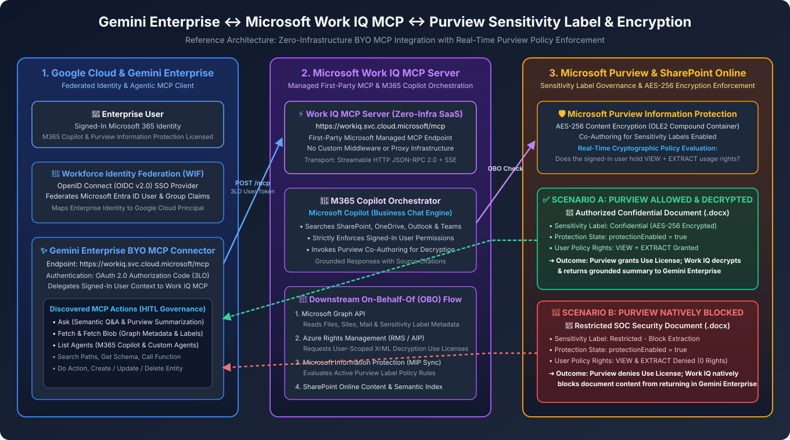

# Gemini Enterprise + Microsoft Work IQ MCP + Microsoft Purview Encryption Enforcement

> **Disclaimer**: This repository and its contents are provided for illustration and educational purposes only as example code. This is not an official Google product or officially supported Google Cloud project. This code is provided as-is for demonstration purposes and is NOT intended or supported for production workloads. The views, code, and opinions expressed in this repository are those of the author(s) and do not necessarily reflect the position, opinions, or official policy of Google LLC or Google Cloud Platform.



## 1. Executive Summary

This solution demonstrates how to connect **Google Cloud Gemini Enterprise (Agentspace)** directly to **Microsoft's Managed Work IQ MCP Server (`https://workiq.svc.cloud.microsoft/mcp`)** as a Bring-Your-Own (BYO) MCP Connector, while enforcing **Microsoft Purview Sensitivity Labels & AES-256 Rights Management (RMS) Encryption** in real time on behalf of the signed-in user.

By combining **Google Cloud Workforce Identity Federation (WIF)** with **OAuth 2.0 Authorization Code (3LO) delegation**, every query from Gemini Enterprise executes under the user's Microsoft Entra ID identity (`On-Behalf-Of` / OBO):
1. **Scenario A — Allowed Path (`Confidential - RMS`)**: When a document in SharePoint Online is encrypted with a Microsoft Purview Sensitivity Label (`protectionEnabled: true`, AES-256 `MS-OFFCRYPTO` OLE2 container) that grants the signed-in user `VIEW` and `EXTRACT` rights, Microsoft Purview issues a dynamic Use License (`XrML`) and Work IQ MCP decrypts and summarizes the content in Gemini Enterprise with clickable source citations.
2. **Scenario B — Blocked Path (`SOC - Restricted Block`)**: When a document in the exact same SharePoint site is encrypted with a Microsoft Purview Sensitivity Label (`protectionEnabled: true`) that excludes the signed-in user (`0` rights — `VIEW` and `EXTRACT` denied), Microsoft Purview denies the decryption Use License and natively blocks the document content from being extracted or summarized in Gemini Enterprise.

---

## 2. End-to-End Architecture

See [`ARCHITECTURE.md`](./ARCHITECTURE.md) for the full architecture and sequence diagrams.

### Key Architectural Components
1. **Google Cloud Workforce Identity Federation (WIF)**:
   - Federates Microsoft Entra ID users and security groups into Google Cloud (`https://iam.googleapis.com/locations/global/workforcePools/<YOUR_WORKFORCE_POOL_ID>/providers/<YOUR_OIDC_PROVIDER_ID>`).
2. **Gemini Enterprise BYO MCP Connector**:
   - Connects directly to Microsoft's zero-infrastructure SaaS MCP endpoint:
     ```text
     https://workiq.svc.cloud.microsoft/mcp
     ```
   - Uses 3-Legged OAuth (`Authorization Code` flow) against your custom Entra ID Application Registration (`<YOUR_ENTRA_CLIENT_ID>`) requesting the global Microsoft Work IQ resource scope:
     ```text
     fdcc1f02-fc51-4226-8753-f668596af7f7/.default offline_access openid profile
     ```
   - Automatically discovers all **11 Work IQ MCP Tools**:
     - `Ask`, `Fetch`, `Fetch Blob`, `List Agents`, `Search Paths`, `Get Schema`, `Call Function`, `Do Action`, `Create Entity`, `Update Entity`, `Delete Entity`.
3. **Microsoft Purview & Azure Rights Management (RMS)**:
   - Evaluates the signed-in user's identity against the file's Purview Sensitivity Label (`EncryptionRightsDefinitions`) before allowing M365 Copilot (`bizchat-as-gpt-scenario`) or SharePoint Online to decrypt the file stream.

---

## 3. Prerequisites & Configuration Checklist

### Step 1: Microsoft 365 & Purview Licensing
Ensure the test user(s) in your Microsoft 365 tenant hold:
- **Microsoft 365 Copilot** license (`MICROSOFT_365_COPILOT_FOR_BUSINESS` or Enterprise equivalent).
- **Microsoft Purview Information Protection** license (e.g., M365 E5 Compliance / Information Protection & Governance) to support Sensitivity Labels with AES-256 encryption.
- **SharePoint Pay-As-You-Go / Metered Graph Billing** linked to an Azure Subscription if using Microsoft Graph `assignSensitivityLabel` programmatically.

### Step 2: Microsoft Entra ID OAuth Client App Registration
1. Register a Web Application in **Microsoft Entra ID** (`<YOUR_ENTRA_CLIENT_ID>`).
2. Configure **API Permissions** (`requiredResourceAccess`):
   - **Work IQ (`fdcc1f02-fc51-4226-8753-f668596af7f7`)**: Add Delegated permissions (`McpServers.Ask.All`, `McpServers.Fetch.All`, `WorkIQAgent.Ask`) and grant tenant-wide Admin Consent.
   - **Microsoft Graph (`00000003-0000-0000-c000-000000000000`)**: Add `Files.ReadWrite.All` and `Sites.ReadWrite.All`.
3. Under **Authentication**, register the Google Cloud WIF / Gemini Enterprise OAuth Redirect URI:
   ```text
   https://auth.cloud.google/signin-callback/locations/global/workforcePools/<YOUR_WORKFORCE_POOL_ID>/providers/<YOUR_OIDC_PROVIDER_ID>
   ```
4. Ensure the App Manifest sets `"requestedAccessTokenVersion": 2`.

### Step 3: Grant Downstream On-Behalf-Of (`oauth2PermissionGrants`) to the First-Party Work IQ Service Principal
In a new Microsoft 365 tenant, the first-party **Work IQ Service Principal** (`appId: fdcc1f02-fc51-4226-8753-f668596af7f7`) must be granted delegated `oauth2PermissionGrants` (`AllPrincipals`) so it can call Microsoft Graph, SharePoint Online, and Azure Rights Management on the user's behalf:
- **Microsoft Graph (`00000003-0000-0000-c000-000000000000`)**:
  `Sites.Read.All Files.Read.All Files.ReadWrite.All Mail.Read User.Read Calendars.Read Chat.Read.All ChannelMessage.Read.All People.Read.All OnlineMeetingTranscript.Read.All Tasks.ReadWrite Group.Read.All InformationProtectionPolicy.Read`
- **Azure Rights Management Services (`00000012-0000-0000-c000-000000000000`)**:
  `user_impersonation`
- **Microsoft Information Protection Sync Service (`00000014-0000-0000-c000-000000000000`)**:
  `UnifiedPolicy.User.Read user_impersonation`
- **SharePoint Online (`00000003-0000-0ff1-ce00-000000000000`)**:
  `AllSites.Read AllFiles.Read AllSites.Write AllFiles.Write`

### Step 4: Enable Purview Co-Authoring & SharePoint IRM
1. In **Purview Compliance PowerShell** (`Connect-IPPSSession`), enable co-authoring for encrypted sensitivity labels:
   ```powershell
   Set-PolicyConfig -EnableLabelCoauth $true
   ```
2. Ensure Azure Rights Management (`AIPService`) is enabled in your tenant and **SharePoint Online IRM** is enabled in the SharePoint Admin Center (`TenantSettings.aspx`) so SharePoint can process encrypted Office files (`d0cf11e0a1b11ae1` OLE2 Compound File format).

### Step 5: Configure Two Purview Sensitivity Labels for Side-by-Side Testing
1. **Allowed Label (e.g., `Confidential - RMS`)**:
   - Enable Encryption (`EncryptionEnabled: $true`).
   - Grant your test user (or tenant domain) `VIEW` and `EXTRACT` rights (`VIEW,DOCEDIT,EDIT,PRINT,EXTRACT,REPLY,REPLYALL,FORWARD,OBJMODEL,OWNER`).
   - Publish the label in an active Purview Label Policy and apply it to your allowed document (`Quantum_Computing_Clean_Purview.docx`).
2. **Blocked Label (e.g., `SOC - Restricted Block`)**:
   - Enable Encryption (`EncryptionEnabled: $true`).
   - Restrict permissions (`EncryptionRightsDefinitions`) strictly to a dedicated security group or restricted user (`secops-restricted@<YOUR_TENANT_DOMAIN>:VIEW,OWNER`) so that your standard test user has **`0` rights** (`VIEW` and `EXTRACT` denied).
   - **Important Purview `ISSUER / OWNER` Rule**: Because Azure RMS automatically grants the identity that applies an encryption label the `ISSUER` / `OWNER` right, apply the `SOC - Restricted Block` label using either an **Application Service Principal** (`client_credentials` with an X.509 certificate) or a separate admin account so your test user is not stamped as the `OWNER`.

---

## 4. Running the Verification Scripts

1. Copy `.env.example` to `.env` and fill in your tenant, application, SharePoint drive, item, and sensitivity label identifiers:
   ```bash
   cp .env.example .env
   ```
2. Export your environment variables and run the verification scripts:
   ```bash
   set -a && source .env && set +a
   python3 test_purview_encryption_and_workiq.py
   python3 test_soc_purview_block.py
   ```
3. Follow [`DEMO_SCRIPT.md`](./DEMO_SCRIPT.md) for the 5-step interactive walkthrough in **Gemini Enterprise**.
