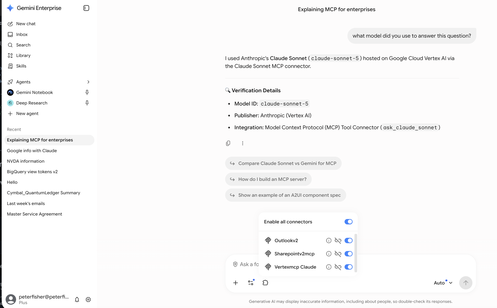
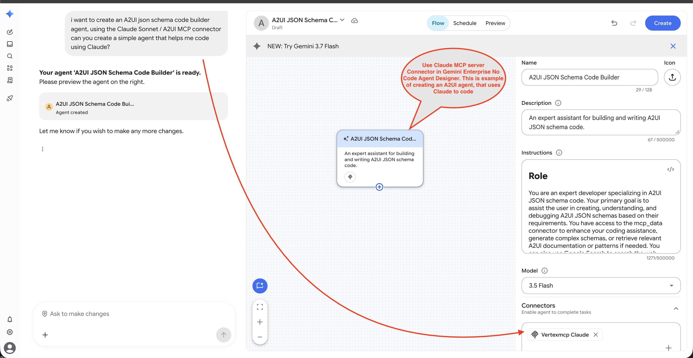
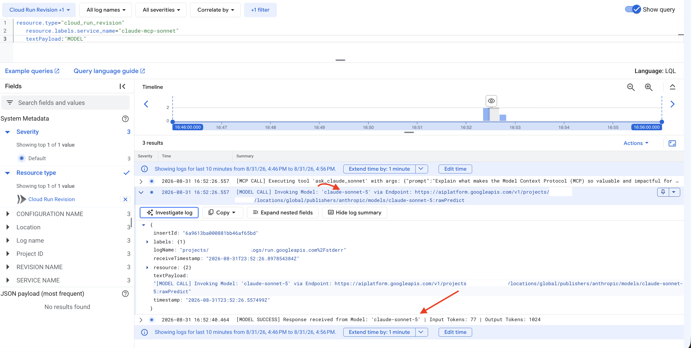

# Claude Sonnet 5 MCP Server for Gemini Enterprise

> **DISCLAIMER:** This project is provided solely as an illustrative sample and proof-of-concept for educational and demonstration purposes. This is **NOT** an official Google product or officially supported Google software. It is provided on an "AS IS" BASIS, WITHOUT WARRANTIES OR CONDITIONS OF ANY KIND, either express or implied, pursuant to the Apache License 2.0.

---

## 🎯 Primary Purpose

This project wraps the **Anthropic Claude Sonnet 5** model endpoint (`publishers/anthropic/models/claude-sonnet-5`) from the **Gemini Enterprise Agent Platform Model Garden** into a production-ready **MCP Server running on Google Cloud Run**.

By containerizing and deploying the Claude Sonnet 5 model endpoint as an SSE-compatible MCP server on Cloud Run, we can easily register it as a **Bring-Your-Own (BYO) MCP Connector** inside **Gemini Enterprise**. 

This directly enables Gemini Enterprise users to access **Claude Sonnet 5** right from Gemini Enterprise as a native connector—opening up powerful new possibilities for enterprise users to leverage Claude for search, complex coding, 1M token context analysis, and incorporating Claude models directly into no-code enterprise agent workflows, all governed by Google Cloud IAM and security policies.

---

## 🏗️ System Architecture Diagram


### 🔒 Why IAM Authentication Matters in this Architecture:
* **End-User Identity Pass-Through**: When Gemini Enterprise invokes the BYO MCP Connector, the end-user's Bearer authentication token is passed directly through the MCP request header to the model endpoint.
* **Granular Role-Based Access Control (RBAC)**: Because the caller's identity is passed through, **the end-user or calling identity must have active Vertex AI IAM permissions (`roles/aiplatform.user`)** on the target Google Cloud project to execute the model API call.
* **Zero Static API Key Leakage**: Eliminates static API keys completely in favor of OAuth 2.0 / IAM short-lived tokens, with automatic fallback to the Cloud Run Service Account Application Default Credentials (ADC) for backend background tasks.
* **Auditing & Enterprise Security Perimeter**: All requests are logged in Cloud Audit Logs with the end-user's verified GCP identity, fully governed under your enterprise VPC Service Controls.

---

## 💡 Key Highlights & Architecture

* **BYO MCP Connector for Gemini Enterprise**: By hosting the Anthropic Claude Model Garden endpoint inside an MCP server on Cloud Run, you can register it as a custom **Bring-Your-Own (BYO) MCP Connector** in the Gemini Enterprise Admin Console.
* **Direct Access to Claude Sonnet 5**: Unlocks Anthropic Claude Sonnet 5 (featuring 1M token input context window and 128k output token generation) for Gemini Enterprise users for multi-turn search, code generation, technical analysis, and building no-code agents.
* **Fully Managed & Serverless on Google Cloud**: The Anthropic Claude models in the Agent Platform Model Garden offer fully managed and serverless models as APIs. To use a Claude model on the Agent Platform, requests are sent directly to the Agent Platform API endpoint. Because Anthropic Claude models use a managed API, **there is no need to provision or manage underlying infrastructure**.
* **Incremental SSE Response Streaming**: You can stream your Claude responses to reduce end-user latency perception. A streamed response uses Server-Sent Events (SSE) to incrementally stream completion chunks back to Gemini Enterprise in real time.
* **Pay-As-You-Go & Provisioned Throughput**: You pay for Claude models as you use them (pay-as-you-go), or you pay a fixed fee when using provisioned throughput. For pay-as-you-go pricing, see the Anthropic Claude models on the Google Cloud pricing page.
* **Read-Only Non-Disruptive Tool Annotations**: Tools are pre-configured with `readOnlyHint: true` and `destructiveHint: false` so Gemini Enterprise executes queries seamlessly without triggering user confirmation prompts.
* **Model Provider Verification Badging**: Every response automatically includes an audit metadata badge verifying the model ID (`claude-sonnet-5`), publisher, token usage, and completion stop reason.
* **Agent-to-User-Interface (A2UI) Generation (Secondary Capability)**: Includes specialized tools to generate structured A2UI JSON components (`a2ui.Card`, `a2ui.DataTable`, `a2ui.Form`, `a2ui.Modal`) for rendering rich interactive widgets.

---

## 🛠️ MCP Tools Reference

| Tool Name | Primary Purpose | Description |
| :--- | :--- | :--- |
| **`ask_claude_sonnet`** | **Core LLM Bridge** | Sends prompts and system instructions to Claude Sonnet 5 in Model Garden and returns text completions with provider verification badges. |
| **`generate_a2ui_component`** | **UI Generation** | Uses Claude Sonnet 5 to generate valid A2UI JSON component specifications for rich UI rendering in frontends. |
| **`get_a2ui_integration_guide`** | **Documentation** | Returns integration guides, component schemas, and best practices for A2UI components. |

---

## 🚀 Quick Start (3-Step Deployment)

Deploying your own Claude Sonnet 5 MCP Server to Cloud Run and connecting it to Gemini Enterprise takes less than 2 minutes:

### 1️⃣ Step 1: Clone & Run Interactive Deployer

Clone the repository and execute `./deploy.sh`:

```bash
git clone https://github.com/peterfishergcp/gps-ai-hub.git
cd gps-ai-hub/projects/ge_mcp/claude_mcp_sonnet
./deploy.sh
```
*The script will prompt for your GCP Project ID, automatically enable required APIs (`run`, `cloudbuild`, `aiplatform`), build the container image, and print your unique SSE Endpoint URL.*

---

### 2️⃣ Step 2: Register BYO MCP Connector in Gemini Enterprise

1. Open **Gemini Enterprise Admin Console** > **Connectors & Tools** > **Add Custom / BYO MCP Connector**.
2. Select **Remote MCP Server (SSE Transport)**.
3. Fill in the exact connector configuration fields:

| Field Name | Recommended Value |
| :--- | :--- |
| **MCP Server URL** | `https://<YOUR_CLOUD_RUN_URL>/mcp` |
| **Authorization URL** | `https://accounts.google.com/o/oauth2/v2/auth` |
| **Authorization URL Parameters** | `&access_type=offline&prompt=consent` |
| **Token URL** | `https://oauth2.googleapis.com/token` |
| **Client ID** | *(Your Google OAuth 2.0 Web Application Client ID)* |
| **Client Secret** | *(Your Google OAuth 2.0 Web Application Client Secret)* |
| **Scopes** | `https://www.googleapis.com/auth/cloud-platform openid email` |
| **Enable PKCE Support** | ❌ Unchecked *(Disabled)* |
| **Use HTTP Basic Authentication** | ✅ Checked *(Enabled)* |

---

### 3️⃣ Step 3: Test in Gemini Enterprise

Ask Gemini Enterprise chat:
> *"Ask Claude about MCP, use the Claude Sonnet MCP connector to help explain what makes MCP so great for enterprises"*

---

## 🎨 Secondary Feature: A2UI (Agent-to-User-Interface)

In addition to model queries, the server includes tools to generate **A2UI specifications**. A2UI allows agents and assistants to return structured UI components instead of plain text or markdown tables.

### Example A2UI Output (`generate_a2ui_component`):

```json
{
  "type": "a2ui.Card",
  "id": "compliance-card-101",
  "title": "Medicaid Audit Finding",
  "subtitle": "High Risk Credential Anomaly",
  "content": {
    "fields": [
      { "label": "Case ID", "value": "NUM-99201", "type": "code" },
      { "label": "Risk Score", "value": "HIGH", "type": "badge", "color": "danger" }
    ]
  }
}
```

---

## ☁️ Environment Variables & Deployment Reference

| Variable | Description | Default |
| :--- | :--- | :--- |
| `PROJECT_ID` | GCP Project ID hosting Model Garden API | `<YOUR_PROJECT_ID>` |
| `LOCATION_ID` | Model Garden Location | `global` |
| `MODEL_ID` | Anthropic model ID in Model Garden | `claude-sonnet-5` |
| `PORT` | Container HTTP listening port | `8080` |

### Manual Deploy Command

```bash
gcloud run deploy claude-mcp-sonnet \
  --source . \
  --region us-central1 \
  --allow-unauthenticated \
  --port 8080 \
  --project <YOUR_PROJECT_ID>
```

---

## 📸 Gemini Enterprise & Claude Sonnet 5 Verification

### 1️⃣ Gemini Enterprise Web UI Response Verification


### 2️⃣ Gemini Enterprise No-Code Agent Designer Integration


### 3️⃣ Google Cloud Logging Audit Trail (`claude-sonnet-5`)


