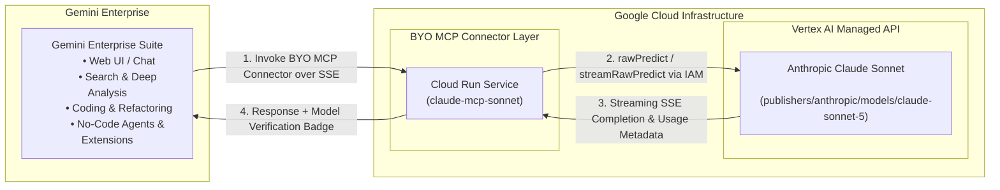

# Claude Sonnet MCP Server for Gemini Enterprise

> **DISCLAIMER:** This project is provided solely as an illustrative sample and proof-of-concept for educational and demonstration purposes. This is **NOT** an official Google product or officially supported Google software. It is provided on an "AS IS" BASIS, WITHOUT WARRANTIES OR CONDITIONS OF ANY KIND, either express or implied, pursuant to the Apache License 2.0.

---

## 🎯 Primary Purpose

This project wraps the Vertex AI **Anthropic Claude Sonnet 3.5/5** model endpoint into a production-ready **MCP Server running on Google Cloud Run**.

By containerizing and deploying the Claude model endpoint as an SSE-compatible MCP server on Cloud Run, we can easily register it as a **Bring-Your-Own (BYO) MCP Connector** inside **Gemini Enterprise**. 

This directly enables Gemini Enterprise users to access Claude models right from Gemini Enterprise as a native connector—opening up powerful new possibilities for enterprise users to leverage Claude for search, complex coding, deep analysis, and incorporating Claude models directly into no-code enterprise agent workflows, all governed by Google Cloud IAM and security policies.

---

## 🏗️ System Architecture Diagram



---

## 💡 Key Highlights & Architecture

* **BYO MCP Connector for Gemini Enterprise**: By hosting the Anthropic Claude Vertex AI model endpoint inside an MCP server on Cloud Run, you can register it as a custom **Bring-Your-Own (BYO) MCP Connector** in the Gemini Enterprise Admin Console.
* **Direct Access to Claude Models**: Unlocks Anthropic Claude 3.5/5 Sonnet for Gemini Enterprise users for multi-turn search, code generation, technical analysis, and building no-code agents.
* **Fully Managed & Serverless on Google Cloud**: The Anthropic Claude models on Google Cloud offer fully managed and serverless models as APIs. Because Anthropic Claude models use a managed API on Vertex AI, **there is no need to provision or manage underlying infrastructure**.
* **Incremental SSE Response Streaming**: You can stream your Claude responses to reduce end-user latency perception. A streamed response uses Server-Sent Events (SSE) to incrementally stream completion chunks back to Gemini Enterprise in real time.
* **Pay-As-You-Go & Provisioned Throughput**: You pay for Claude models as you use them (pay-as-you-go), or you pay a fixed fee when using provisioned throughput. For pay-as-you-go pricing, see the Anthropic Claude models on the Google Cloud pricing page.
* **Read-Only Non-Disruptive Tool Annotations**: Tools are pre-configured with `readOnlyHint: true` and `destructiveHint: false` so Gemini Enterprise executes queries seamlessly without triggering user confirmation prompts.
* **Model Provider Verification Badging**: Every response automatically includes an audit metadata badge verifying the model ID, publisher, token usage, and completion stop reason.
* **Agent-to-User-Interface (A2UI) Generation (Secondary Capability)**: Includes specialized tools to generate structured A2UI JSON components (`a2ui.Card`, `a2ui.DataTable`, `a2ui.Form`, `a2ui.Modal`) for rendering rich interactive widgets.

---

## 🛠️ MCP Tools Reference

| Tool Name | Primary Purpose | Description |
| :--- | :--- | :--- |
| **`ask_claude_sonnet`** | **Core LLM Bridge** | Sends prompts and system instructions to Claude Sonnet on Vertex AI and returns text completions with provider verification badges. |
| **`generate_a2ui_component`** | **UI Generation** | Uses Claude Sonnet to generate valid A2UI JSON component specifications for rich UI rendering in frontends. |
| **`get_a2ui_integration_guide`** | **Documentation** | Returns integration guides, component schemas, and best practices for A2UI components. |

---

## 🔌 Registering as a BYO MCP Connector in Gemini Enterprise

Because the Claude model endpoint is wrapped as an MCP server running on Cloud Run, registering it as a **BYO MCP Connector** in **Gemini Enterprise** takes just a few clicks:

1. Deploy the MCP server container to Cloud Run (or use the deployed SSE endpoint).
2. Open **Gemini Enterprise Admin Console** > **Connectors & Tools** > **Add Custom / BYO MCP Connector**.
3. Select **Remote MCP Server (SSE Transport)**.
4. Enter the connector configuration:
   * **Connector Name**: `claude-sonnet-vertex`
   * **SSE Endpoint URL**: `https://claude-mcp-sonnet-726122012742.us-central1.run.app/mcp`
   * **Authentication**: Google Cloud IAM / Service Account ADC.

Once registered, Gemini Enterprise users can access Claude for search, coding, and reasoning directly:
> *"Use Claude Sonnet to refactor this Python script and optimize performance."*  
> *"Have Claude Sonnet summarize this technical specification."*

---

## 🎨 Secondary Feature: A2UI (Agent-to-User-Interface)

In addition to model queries, the server includes tools to generate **A2UI specifications**. A2UI allows agents and assistants to return structured UI components instead of plain text or markdown tables.

### Example A2UI Output (`generate_a2ui_component`):

```json
{
  "type": "a2ui.Card",
  "id": "compliance-card-101",
  "title": "Medicaid Audit Finding",
  "subtitle": "High Risk Credential Anomaly",
  "content": {
    "fields": [
      { "label": "Case ID", "value": "NUM-99201", "type": "code" },
      { "label": "Risk Score", "value": "HIGH", "type": "badge", "color": "danger" }
    ]
  }
}
```

---

## ☁️ Environment & Deployment

### Environment Variables

| Variable | Description | Default |
| :--- | :--- | :--- |
| `PROJECT_ID` | GCP Project ID hosting Vertex AI | `ai-hub-459714` |
| `LOCATION_ID` | Vertex AI Location | `global` |
| `MODEL_ID` | Anthropic model ID on Vertex AI | `claude-sonnet-5` |
| `PORT` | Container HTTP listening port | `8080` |

### Deploy to Cloud Run

```bash
gcloud run deploy claude-mcp-sonnet \
  --source . \
  --region us-central1 \
  --allow-unauthenticated \
  --port 8080 \
  --project ai-hub-459714
```
