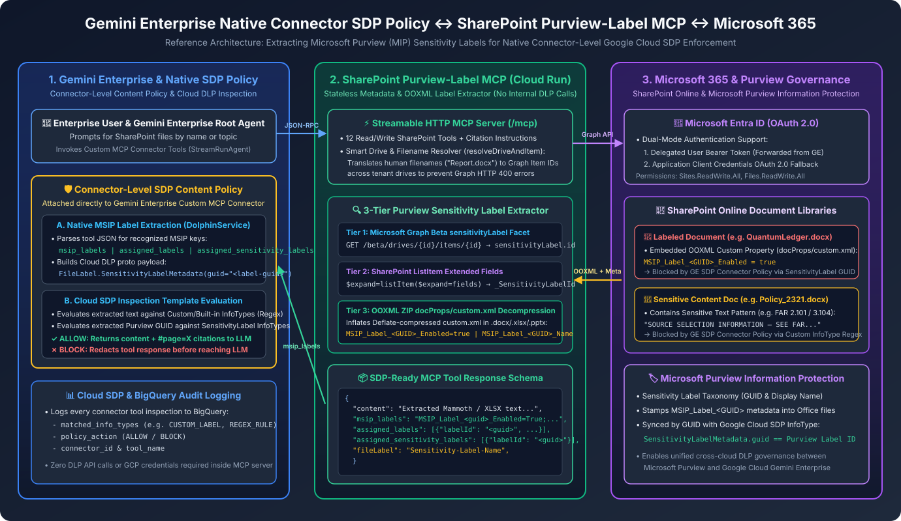
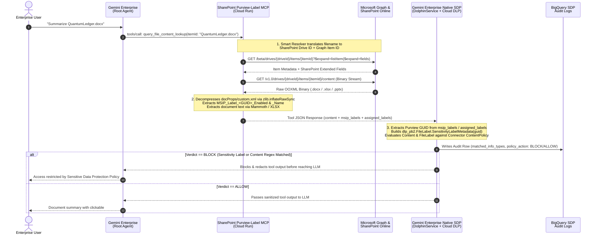

# SharePoint MCP Server with Microsoft Purview Sensitivity Label Extraction for Gemini Enterprise Native SDP

> **Disclaimer**: This repository and its contents are provided for illustration and educational purposes only as example code. This is **NOT** an official Google product or officially supported Google software. It is provided on an "AS IS" BASIS, WITHOUT WARRANTIES OR CONDITIONS OF ANY KIND, either express or implied, pursuant to the Apache License 2.0.



## 1. Overview

This Model Context Protocol (MCP) server bridges **Microsoft SharePoint Online / OneDrive** with **Google Cloud Gemini Enterprise**, enabling **Gemini Enterprise's native connector-level Sensitive Data Protection (SDP) Content Policy** to inspect and enforce `ALLOW` / `BLOCK` verdicts on both:
1. **Document Text Content (Built-in & Custom Regex InfoTypes)** — e.g., blocking documents containing restricted procurement clauses (`SOURCE SELECTION INFORMATION — SEE FAR 2.101 AND 3.104`) or PII/credentials.
2. **Microsoft Purview (MIP) Sensitivity Label GUIDs (`FileLabel.SensitivityLabelMetadata`)** — e.g., blocking documents tagged in Microsoft 365 with a restricted Purview sensitivity label GUID (`11111111-2222-3333-4444-555555555555`).

Unlike architectures where the MCP server calls Google Cloud DLP APIs internally, **this MCP server makes zero calls to Google Cloud SDP/DLP**. Instead, it extracts Microsoft Purview sensitivity label metadata from SharePoint and Office binary containers (`.docx`, `.xlsx`, `.pptx`) and returns it in the exact JSON schema that Gemini Enterprise (`DolphinService`) natively parses for connector-level SDP enforcement.

---

## 2. End-to-End Architecture & Sequence Flow



---

## 3. What Any Custom MCP Server Must Include to Leverage a Connector-Level SDP Policy

When you attach a **Content Policy (`projects/<PROJECT_ID>/locations/<LOCATION>/contentPolicies/<POLICY_ID>`)** to a Custom MCP Connector in Gemini Enterprise, Discovery Engine (`DolphinService`) intercepts every MCP tool response before passing it to the LLM.

To ensure your Custom MCP server works seamlessly with Gemini Enterprise's native SDP policy for **both content inspection and Microsoft Purview sensitivity labels**, your MCP server must implement the following four requirements:

### Requirement 1: Expose Recognized MSIP Label Keys in the Tool Response JSON
Gemini Enterprise's native label parser scans the JSON dictionary returned by your MCP tool (`result.content[].text`) for specific Microsoft Information Protection (MSIP) keys. Generic custom keys like `sensitivityLabel.id` or `fileLabel` alone will **not** populate `dlp_pb2.FileLabel.SensitivityLabelMetadata`.

Your MCP tool response must include at least one (or all) of the following recognized keys whenever a file has a sensitivity label:

| Recognized JSON Key | Expected Format | Example Value |
| :--- | :--- | :--- |
| **`msip_labels`** *(Recommended)* | MAPI semicolon-delimited string containing `MSIP_Label_<GUID>_Enabled=True` (and optional `_Name`), **or** a bare 36-char GUID string | `"MSIP_Label_11111111-2222-3333-4444-555555555555_Enabled=True;MSIP_Label_11111111-2222-3333-4444-555555555555_Name=Highly-Confidential"` |
| **`assigned_labels`** | Array of objects containing **`labelId`** (not `id`) and `displayName` | `[{"labelId": "11111111-2222-3333-4444-555555555555", "displayName": "Highly-Confidential"}]` |
| **`assigned_sensitivity_labels`** | Array of objects containing **`labelId`** (or `label_id`) and `displayName` | `[{"labelId": "11111111-2222-3333-4444-555555555555", "displayName": "Highly-Confidential"}]` |
| **`singleValueExtendedProperties`** | Exchange/Graph MAPI Extended Property array | `[{"id": "String {00020386-0000-0000-c000-000000000046} Name msip_labels", "value": "MSIP_Label_<GUID>_Enabled=True"}]` |

#### Example SDP-Compatible MCP Tool Output (`query_file_content_lookup`)
```json
{
  "content": "Extracted document text...",
  "name": "QuantumLedger.docx",
  "webUrl": "https://your-tenant.sharepoint.com/sites/Finance/Shared%20Documents/QuantumLedger.docx?web=1",
  "msip_labels": "MSIP_Label_11111111-2222-3333-4444-555555555555_Enabled=True;MSIP_Label_11111111-2222-3333-4444-555555555555_Name=Highly-Confidential",
  "assigned_labels": [
    {
      "labelId": "11111111-2222-3333-4444-555555555555",
      "displayName": "Highly-Confidential"
    }
  ],
  "assigned_sensitivity_labels": [
    {
      "labelId": "11111111-2222-3333-4444-555555555555",
      "displayName": "Highly-Confidential"
    }
  ],
  "fileLabel": "Highly-Confidential",
  "purviewSensitivityGuid": "11111111-2222-3333-4444-555555555555"
}
```

---

### Requirement 2: Decompress OOXML `docProps/custom.xml` for Unencrypted Office Files
In Microsoft 365, unencrypted Office documents (`.docx`, `.xlsx`, `.pptx`) tagged with a Purview sensitivity label often do **not** populate the Microsoft Graph v1.0 `sensitivityLabel` facet unless SharePoint metered label extraction is enabled. Instead, Microsoft Office stamps the Purview sensitivity label inside the file's `docProps/custom.xml` container:
```xml
<property fmtid="{D5CDD505-2E9C-101B-9397-08002B2CF9AE}" pid="2" name="MSIP_Label_11111111-2222-3333-4444-555555555555_Enabled">
  <vt:lpwstr>true</vt:lpwstr>
</property>
<property fmtid="{D5CDD505-2E9C-101B-9397-08002B2CF9AE}" pid="4" name="MSIP_Label_11111111-2222-3333-4444-555555555555_Name">
  <vt:lpwstr>Highly-Confidential</vt:lpwstr>
</property>
```
> **Critical Implementation Detail**: Because `.docx`, `.xlsx`, and `.pptx` files are ZIP archives that use **Deflate compression (`compressionMethod = 8`)**, running a plain regex against the raw binary buffer will **fail** to find `MSIP_Label_<GUID>`. Your MCP server must locate the `docProps/custom.xml` ZIP entry and inflate it (`zlib.inflateRawSync` in Node.js) before matching `MSIP_Label_<GUID>` (implemented in `extractOoxmlCustomProperties()` in `index.js`).

---

### Requirement 3: Scope `msip_labels` to File-Level Tools (Not Folder Listing Tools)
Gemini Enterprise evaluates the **entire** JSON response of an MCP tool call as a single unit:
- If a directory listing tool (`query_library_items_lookup`) emits `msip_labels` or `assigned_labels` for every file in a folder, then a **single** restricted file in that folder will cause SDP to `BLOCK` the entire directory listing—preventing the agent from discovering or reading unrestricted files in the same library.
- **Best Practice**:
  - In **folder listing tools** (`query_library_items_lookup`), return human-readable metadata (`fileLabel`, `purviewSensitivityGuid`) *without* `msip_labels` / `assigned_labels`.
  - In **file-level tools** (`query_file_content_lookup`, `query_file_metadata_lookup`, `query_file_download_url_lookup`), include `msip_labels`, `assigned_labels`, and `assigned_sensitivity_labels` so SDP blocks access when a restricted file is actually inspected or read.

---

### Requirement 4: Resolve Human Filenames in File-Level Tools
When a user asks Gemini Enterprise *"Summarize QuantumLedger.docx"*, the root agent may immediately call `query_file_content_lookup({ itemId: "QuantumLedger.docx" })` without calling `query_library_items_lookup` first to look up the 34-character Microsoft Graph DriveItem ID.
- Passing a human filename directly to `GET /drives/{driveId}/items/{itemId}` causes Microsoft Graph to return `HTTP 400 Bad Request`.
- Our MCP server implements `resolveDriveAndItem()` in `index.js` to detect when `itemId` is a filename (e.g., contains a file extension `.docx` or spaces) and automatically resolves both the target SharePoint `driveId` and the Graph `itemId` before fetching the file.

---

## 4. Supported MCP Tools

### 🔍 Read Tools (`readOnlyHint: true`)
1. **`query_sharepoint_sites_lookup`**: Search and list SharePoint sites across the tenant.
2. **`query_document_libraries_lookup`**: List document libraries (drives) within a SharePoint site.
3. **`query_library_items_lookup`**: List files and folders in a document library with descriptive sensitivity label metadata.
4. **`query_file_metadata_lookup`**: Retrieve detailed file metadata and native `msip_labels` / `assigned_labels` for SDP inspection.
5. **`query_file_content_lookup`**: Extract readable text from Word (`.docx`), Excel (`.xlsx`), and text files alongside native `msip_labels` / `assigned_labels` for SDP content + label inspection.
6. **`query_file_download_url_lookup`**: Retrieve pre-authenticated download URLs alongside native `msip_labels` / `assigned_labels`.

### ✏️ Write Tools (`destructiveHint: true` — Protected by Gemini Enterprise Action Approval)
7. **`query_create_file_action_lookup`**: Create/upload a new text file in SharePoint.
8. **`query_update_file_action_lookup`**: Update an existing file's content.
9. **`query_create_folder_action_lookup`**: Create a new folder in a document library.
10. **`query_rename_item_action_lookup`**: Rename an existing file or folder.
11. **`query_delete_item_action_lookup`**: Delete a file or folder.
12. **`query_move_item_action_lookup`**: Move a file or folder to a target folder.

---

## 5. Setup & Deployment to Google Cloud Run

### Step 1: Configure Environment Variables
Copy `.env.example` to `.env` and populate your Microsoft Entra ID (Azure AD) App Registration credentials and Google Cloud project ID:

```bash
cp .env.example .env
```

```ini
MS_GRAPH_TENANT_ID=<YOUR_ENTRA_TENANT_ID>
MS_GRAPH_CLIENT_ID=<YOUR_ENTRA_CLIENT_ID>
MS_GRAPH_CLIENT_SECRET=<YOUR_ENTRA_CLIENT_SECRET>
SHAREPOINT_INSTANCE_URL=https://<YOUR_TENANT>.sharepoint.com
GCP_PROJECT=<INSERT_YOUR_PROJECT_ID>
GCP_REGION=us-central1
```

> **Entra ID App Permissions**: Grant `Sites.ReadWrite.All` and `Files.ReadWrite.All` (Application and/or Delegated permissions) with Admin Consent in Microsoft Entra ID.

### Step 2: Test Locally
```bash
chmod +x test_local.sh test_get_docs.sh
./test_local.sh
```

### Step 3: Deploy to Cloud Run
```bash
chmod +x deploy.sh
./deploy.sh
```

### Step 4: Register Connector & Attach SDP Policy in Gemini Enterprise
1. In the Google Cloud Console, navigate to **Gemini Enterprise → Connectors** and create a **Custom MCP** connector pointing to:
   ```text
   https://<YOUR_CLOUD_RUN_SERVICE_URL>/mcp
   ```
2. Attach your **Sensitive Data Protection (SDP) Content Policy** (`projects/<PROJECT_ID>/locations/<LOCATION>/contentPolicies/<POLICY_ID>`) configured with:
   - Your **Custom/Built-in Content InfoTypes** (e.g., regex detectors).
   - Your **Sensitivity Label InfoTypes** matching your Microsoft Purview Sensitivity Label GUID(s).
3. Connect the MCP data store to your Gemini Enterprise App/Engine and test querying both allowed and restricted SharePoint documents.
